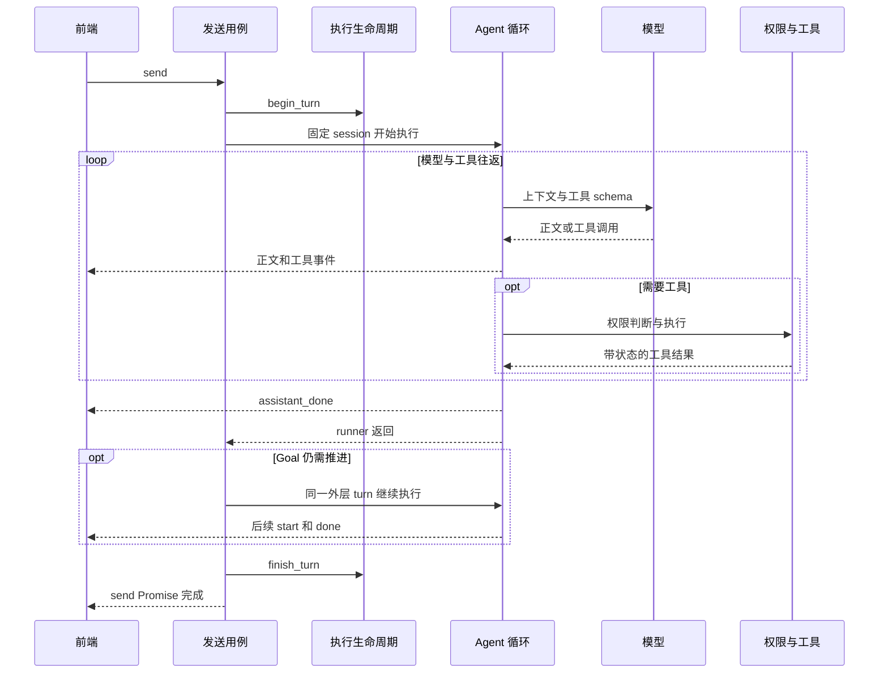

# Demiurge 开发接手指南

本文面向接手开发与后续重构，说明一条消息如何执行、状态由谁持有、修改应从哪里进入，以及哪些行为需要先建立回归保护。基于 2026 年 10 月 2 日的工作区，代码基线为 `9c72d3f4214d13eb5f2152f87ef8eb44acebf3ac`。

本轮已实施执行身份、消息投影、工具执行、权限设置和快照排序的首批优化。下面的基线与问题复现保留为优化前证据；当前实现与验收结果以 [优化与验收记录](OPTIMIZATION-VERIFICATION.md) 为准。后续仍可按功能逐批拆分设置、导航与持久化关闭策略，不应据此假设这些工作已经全部完成。

## 优化前开发与验证基线

| 验证 | 本次结果 | 证明范围 |
| --- | --- | --- |
| `npm test` | 同一会话、同一代码基线下 53 项通过 | 25 项纯逻辑或 mock 行为测试，28 项源码或资源契约检查 |
| `npm run build` | TypeScript 与 Vite 构建通过 | 有较大 chunk 提示，Live2D chunk 约 1106 kB，gzip 约 308 kB |
| `cargo test --manifest-path backend/Cargo.toml --workspace --all-targets --locked --offline` | 328 项通过，0 失败、0 忽略 | Desktop 306、架构边界 4、Common 5、Core 6、Framework 7；Windows 默认 feature |
| Goal 续跑事件序列 | 现有前端 reducer 拒绝同一 turn 第一次 done 后的续跑事件 | 已运行状态机复现，未进行完整桌面流程复现 |
| 桌面与远端联调 | 未执行 | 不代表真实模型、录音、OCR、窗口或其他操作系统已验证 |

本机 Rust 工具链为 1.96.0，Rust 测试使用已有缓存，未下载或安装依赖。前端测试和构建在前一轮解析已完成，本轮未重复运行。现有跨前端、Tauri IPC、后端的端到端测试仍是预留，见 [测试目录说明](../tests/README.md)。

常用开发命令在仓库根目录执行：

```text
npm run tauri dev
npm test
npm run build
cargo fmt --manifest-path backend/Cargo.toml --all -- --check
cargo test --manifest-path backend/Cargo.toml --workspace --all-targets --locked
npm run tauri build
```

`npm run dev` 只启动 Vite，浏览器中的界面不能代表原生 IPC 已接通。桌面启动脚本会选择可用端口并生成 `.tauri-dev` 配置。Live2D 另需获取 Cubism Core，参见根 README。格式检查和安装包构建属于后续门禁命令，本次未执行。

## 第一遍读码路线

按用户行为走一遍，再扩展到相邻模块，比按目录逐文件阅读更有效。

| 顺序 | 阅读入口 | 要回答的问题 |
| --- | --- | --- |
| 1 | [main.tsx](../frontend/src/main.tsx)、[starter.rs](../backend/Demiurge-desktop/src/starter.rs) | 哪个窗口挂载哪个根组件；设置、会话、凭据、工作区如何恢复 |
| 2 | [App.tsx](../frontend/src/app/App.tsx) 的 `handleSend` | 用户输入如何形成请求；何时设置 busy；错误与历史恢复由谁处理 |
| 3 | [api.ts](../frontend/src/lib/api.ts) 的 `send`、`listenAgentEvents` | 命令返回和流式事件是两条什么样的通道 |
| 4 | [biz/agent.rs](../backend/Demiurge-desktop/src/biz/agent.rs) 的 `send` | 谁开始执行、处理 slash、驱动 Goal、结束执行 |
| 5 | [session_engine.rs](../backend/Demiurge-desktop/src/agent/session_engine.rs) | 执行归属、事件身份、取消、消息写入与终态如何联系 |
| 6 | [runner.rs](../backend/Demiurge-desktop/src/agent/runner.rs) | 上下文、模型、工具、权限、记忆和预算如何形成循环 |
| 7 | [agentEventReducer.ts](../frontend/src/lib/agentEventReducer.ts)、[navigationEpoch.ts](../frontend/src/lib/navigationEpoch.ts) | 为什么旧事件和旧导航响应不能直接提交到界面 |
| 8 | [core/session.rs](../backend/Demiurge-core/src/session.rs)、[persistence/session.rs](../backend/Demiurge-framework/src/persistence/session.rs) | 消息、事件审计、磁盘快照和恢复分别是什么 |

四个 Rust crate 的依赖方向已由架构测试约束，但 Agent、工具、模型协议与系统操作仍主要在 Desktop。`core` 当前以 Session、Goal 的状态和规则为主；`framework` 的实际模块是 persistence 与 remote。不要把设计文档中的目标目录或 `SessionRepository` 示例直接当作现成实现。

聊天入口走 `controller → biz → agent`。也存在 `controller/workspace.rs → workspace.rs` 的直接委托，因此不能推断所有 command 都经过独立的同名 biz 模块。已有 Controller 约束主要防止直接持久化、持锁或访问外部 SDK。

## 必须区分的领域概念

| 概念 | 代码中的含义 | 容易混淆之处 |
| --- | --- | --- |
| Session | 持久化会话，含项目路径、消息、摘要、Goal 和事件记录 | 当前选中的 Session 不一定是正在执行的 Session |
| Engine turn | `begin_turn` 到 `finish_turn` 的主执行生命周期 | 一次 turn 可以包含多次模型调用，也可以包含多轮 Goal 续跑 |
| 模型请求 | 一次具体 provider/model 调用 | 工具往返和模型回退会生成更多请求 |
| 一次回答完成 | runner 发出 `assistant_done` | 此后可能还有记忆提取或 Goal 续跑，不等于 engine turn 已空闲 |
| Workflow run | 独立后台工作流，以 run_id 标识 | 当前并不完整持有创建时的 session 和项目身份 |
| Workspace | 会话绑定的项目目录；运行时映射为 `sandbox_dir` | 字段名 sandbox 不意味着所有命令都具有操作系统级隔离 |
| PermissionContext | 捕获的会话、规范化项目身份与角色包权限偏好 | 权限模式与规则仍可能动态读取，并非整套权限策略被冻结 |
| NavigationSnapshot | 会话列表、history、workspace、goal 的一致返回值 | 前端必须作为同一份合法导航快照提交 |

前端还存在三种不同的忙碌状态：提交命令的本地 `busy`、后端 `sessionEngine.busy`、导航中的 `navigationPending`。`appBusy` 合并前两者，交互限制进一步考虑导航；提取模块时不能直接合成一个含义模糊的布尔变量。

## 一次消息的执行过程

### 发送与初始化

`Composer` 管理附件及临时资源，`App.handleSend` 捕获当前 session，清空输入，追加乐观用户消息，再调用 `api.send` 或 `sendWithAgents`。该 IPC Promise 等到整次后端执行结束才返回，不是请求入队的确认。前端 `handleSend` 的 true 表示经过了发送路径，捕获错误后也会返回 true，不能用它判断生成成功。

后端 `biz::send` 捕获 session id 并调用 `begin_turn`。后者使用全局 busy 阻止并发主回合，登记 active turn。slash 和陪伴特殊回复可以绕过普通模型循环；这些直接回复可能没有 `assistant_start`，前端不能强制每条完成消息都先出现 start。

runner 在异步 MCP 初始化之前捕获权限身份，克隆 Settings，之后创建绑定明确 session 的 `SessionTurnStore`。模型和预算使用这次 runner 的设置快照；Goal 再次调用 runner 时会重新取得设置。

### 模型与工具循环

1. 读取绑定会话的消息和摘要，组合角色、Skills、Lorebook、项目说明、记忆和 Goal。
2. 根据预算裁剪历史；摘要成功后，通过 expected messages/summary 检查提交压缩结果，防止覆盖期间新增的消息。
3. 通过 `model_routing` 调用模型；每次尝试记录实际请求的消息、工具 schema、provider、model 和 purpose。回退仍在同一 provider 配置内进行。
4. 模型正文以事件回传；失败后的回退会重新发 start 清理当前正文投影。一次 engine turn 可以有多个 start。
5. 请求工具时，先解析 deferred wrapper 对应的真实工具，再决定权限、展示确认、记录授权或拒绝，最后执行并写入工具结果。
6. 工具结果回到模型上下文，继续下一次请求。主 runner 的工具批次当前串行执行，主循环上限为 16 步；每步可以发生模型回退，摘要和记忆也有独立调用，因此这不是总网络请求数上限。
7. 没有工具请求时写入最终正文并发 done；随后仍可能进行自动记忆提取。外层用例再决定是否驱动 Goal，最后才 finish turn。

工具结果的前端展示有长度上限，模型上下文与结构化执行记录另行保存。重构不能把展示截断错误地复用于模型输入。



### 导航与展示

后端历史是持久事实，前端 `items` 是历史和实时事件共同形成的展示投影。长驻监听使用 ref 读取最新会话身份；正文和推理增量经动画帧合并，最终 done 使用完整正文修复遗漏的 delta。

会话导航通过 epoch 和 request 代次过滤迟到返回，再一次提交 history、workspace 与 goal。提交时同步更新 activeIdRef，并清理旧增量、当前 assistant、工具卡映射和确认框。只把监听回调移动到新 hook、继续向它传入大量 setter，不能集中这些一致性约束。

## 状态归属与必须保护的行为

| 状态 | 当前所有者 | 改动时必须保护的行为 |
| --- | --- | --- |
| 消息、摘要、事件 | SessionStore 与 SessionTurnStore | 写入明确执行 session；压缩拒绝过期快照 |
| 主执行状态 | SessionEngine 与全局 busy/cancel | 正常、失败、取消都必须结束所属执行并释放占用 |
| 事件归属 | TurnEventEmitter 动态读取 active turn | 当前依赖单个主执行；并发前必须改为明确归属 |
| 项目根 | 全局 sandbox_dir | 主聊天依靠禁止忙碌时跨项目切换间接稳定，并非工具持有不可变项目参数 |
| 权限身份 | runner 捕获的 PermissionContext | 确认返回后的规则记忆与审计仍归原 session/project |
| 待确认操作 | 后端 owner gate 与 id→oneshot；前端 ToolConfirmationState | 固定 session/turn，取消封锁迟到确认，重复响应与失效等待器被清理 |
| Plan 状态 | AppState 全局 PlanState | 改为多任务并发前需要明确其归属 |
| Workflow | runs 内的 ExecutionContext、定义快照与独立取消标志 | 运行身份、读路径、日志路径、恢复与重试固定到启动项目 |
| 消息展示 | MessageProjection 与 AgentEventReducer | 拥有历史重建、回答/工具关联、帧缓冲、错误去重与恢复；App 订阅快照 |
| 语音播放 | useStreamingTtsQueue | 中断停止当前播放，迟到合成结果不能重新播放 |

取消并不意味着所有执行立即完成。现有入口设置取消状态并拒绝所有 pending confirmations；真正退出后才清 busy。工具调用与工具结果需要配对，即使取消也应保留明确的未执行结果，避免后续模型请求协议失配。

本轮移除了 runner 再次清除 cancel 的逻辑；工具事务在权限确认后再次检查取消，确认等待器在注册时检查取消且在超时、发射失败或 future 被释放时清理。取消摘要或路由请求按 interrupted 结束。测试覆盖批准后取消无写入、迟到确认拒收和真实 oneshot 清理；已执行中的第三方工具并不因此获得事务回滚能力。

会话持久化使用后台整库快照、同目录原子替换和备份恢复；快照获取与序号分配现已置于同一个 sessions 锁内，确定性乱序写盘测试通过。Session 的事件序列支持重建，但并不代表每个事件已经同步持久化。`persist_sessions` 返回不代表落盘成功；当前没有关闭 flush，退出前未提交的快照仍可能丢失。Workflow 重启后的 Running 会变成 StaleRunning，不会自动恢复原执行任务。

## 优化前定位的跨模块问题与修复状态

### Goal 续跑与回答终态冲突

已修复：同一外层 engine turn 内，每次 runner 回答拥有独立 response_id；MessageProjection 和 reducer 区分回答终态与外层执行终态，并保留旧事件拒收。以下为修复前路径与复现记录。

证据等级为代码路径确认加现有状态机复现，尚未进行 Tauri GUI 全链路复现。

`biz/agent.rs` 在同一个 engine turn 内先执行普通 runner，再执行 `goal::drive_after_turn`；`goal.rs` 续跑时再次调用 runner，没有创建新的外层 turn。TurnEventEmitter 每次发送事件读取的是同一个 active turn。

前端 `AgentEventReducer` 第一次收到 done 后，关闭整个 `(sessionId, turnId)`。直接加载现有 TypeScript 模块并输入以下事件序列，得到：

| 同一 session 和 turn 的事件 | accepted | reason |
| --- | --- | --- |
| 第一次 start、delta、done | 三次均为 true | 无 |
| 续跑 start、delta、done | 三次均为 false | closed |

done 后的 `refreshGoalPanel` 读取导航快照时不替换历史；send 完成后的 `syncHistoryIfMissingAssistant` 在已经存在首条完成回答时直接返回。这些补偿路径不能可靠恢复被拒收的续跑回答。

后续应区分 engine 执行、回答或 continuation 的身份，并规定哪种事件真正关闭执行。不能仅删除 closed 判断，否则会重新接受过期或重复事件。验收必须同时覆盖连续两次回答可见、真正旧 turn 被拒绝、done 幂等以及模型回退的 start 重置。

关键证据：[外层执行](../backend/Demiurge-desktop/src/biz/agent.rs)、[Goal 续跑](../backend/Demiurge-desktop/src/agent/goal.rs)、[事件身份](../backend/Demiurge-desktop/src/agent/session_engine.rs)、[前端终态判断](../frontend/src/lib/agentEventReducer.ts)、[历史补偿](../frontend/src/app/App.tsx)。

### Workflow 的执行身份依赖当前全局状态

已修复：启动时固定 ExecutionContext 和渲染后的定义；项目根贯穿读取、Prompt、日志、快照与重试，取消令牌独立于主聊天。缺可靠归属的旧数据可查看但不能猜测身份续跑。以下为修复前路径记录。

证据等级为静态路径确认。未运行跨项目场景，不宣称已观察到文件串写。

- `WorkflowRunProgress` 没有保存 session_id 和 workspace_root；launch 时虽计算 journal_path，但后续读写未统一使用它。
- Workflow launch 不占用主聊天 busy；后台任务重新加载定义时仍按当前 sandbox 寻址。
- Agent 节点没有向 SubagentRequest 传递固定 session/workspace；子 Agent 运行时才读取当前执行或活动会话。
- 文件工具从全局 sandbox 读取根目录；journal 每次 append 重新取当前 sandbox。
- `persist_all_run_snapshots` 将内存中全部 runs 写到当前 sandbox，没有按每次运行的原项目分组。

因此，在 Workflow 执行期间切换项目或同时发起主聊天，存在上下文、审计归属和框架写盘路径漂移风险。节点的 ReadOnly scope 限制工具能力，不能约束框架自身的 journal/state 写入。

后续应在 launch 时创建明确的运行上下文，贯穿定义读取、节点执行、权限身份、工具根、事件和日志。先用两个临时项目、可暂停节点和不同内容文件建立确定性测试，再修改实现。历史 Workflow 快照缺少身份字段的迁移或拒绝策略也要单独定义。

关键证据：[Workflow 运行与快照](../backend/Demiurge-desktop/src/agent/workflow_runtime.rs)、[journal](../backend/Demiurge-desktop/src/agent/workflow_journal.rs)、[子 Agent](../backend/Demiurge-desktop/src/agent/subagent.rs)、[文件工具](../backend/Demiurge-desktop/src/tools/read_file.rs)。

### 能力说明与实际实现的区别

Shell 的 Standard/Strict 仅提供部分限制，不能等同操作系统文件系统或网络隔离。Sandboxed 模式依赖平台 wrapper 验证；当前 Windows 不支持并拒绝执行。Computer Use 工具注册的是窗口、截图与 OCR，完整点击输入闭环仍待实现。本地 embedding 在默认构建中不创建 provider，回落到 BM25；启用 `embeddings-local` feature 后调用预留实现才会明确报未接入错误。实际向量路径是 remote provider。应让产品说明和设置展示与这些边界一致。

## 优化路线与剩余范围

以下路线保留为后续开发参照。批次 1、2、4 已完成本轮切面；批次 3 已集中消息投影，导航仍沿用现有 epoch；批次 5 先完成权限/Shell 域；批次 6 先修复快照排序，关闭 flush 与运行时依赖迁移尚未实施。各批次具体结果见验收记录。

| 批次 | 具体工作 | 验收条件 |
| --- | --- | --- |
| 1 执行与事件契约 | 明确 selected session、execution session、engine turn、回答、Workflow run；补 Goal 续跑和 Workflow 切项目场景 | 先让测试稳定暴露当前问题，再验证修复；保留旧事件拒收与同 session 写入约束 |
| 2 Workflow 运行归属 | 入口固定运行身份、项目根与取消作用域，贯穿子 Agent、工具、journal 和 snapshot | 切到项目 B 后，项目 A 的运行继续读取 A，日志与快照只写 A；不借用同时发生的主聊天身份 |
| 3 前端消息与导航模块 | 集中历史重建、流事件、当前回答/工具、帧缓冲、错误去重与恢复；另集中导航快照提交 | 同一事件序列在可控调度下生成确定消息列表；无需调用者协调内部 refs 和十几个 setter |
| 4 后端工具执行模块 | 集中真实工具解析、权限、确认、取消再检查、执行、审计和 ToolExecutionRecord | 拒绝或取消时无未授权副作用；每个调用对应一个明确结果；仍保持串行工具语义 |
| 5 设置模块 | 按 Provider、权限、角色包、记忆等功能迁移状态与异步请求 | 保留设置草稿、预览、保存与立即执行操作各自的提交语义，避免仅搬 JSX |
| 6 持久化与运行时依赖 | 明确写入确认和关闭策略，逐步减少对完整 AppState/AppHandle 的依赖 | 故障注入、乱序快照、恢复与退出验证通过后，再评估跨 crate 迁移或并发能力 |

这里的模块指用小接口封装一组完整行为。接口不仅是参数和返回值，还包括身份归属、调用顺序、错误、取消和持久化承诺。现成的 `SessionTurnStore`、导航 epoch、TTS 队列已经各自隐藏了一部分复杂性，应优先复用。

首轮不顺带扩大主会话并发、不迁移数据库、不统一重写所有 provider，也不改变权限作用域优先级、Plan/Auto/Bypass、Goal 预算或 Workflow 重启语义。事件契约修正若必须扩展字段，应明确兼容方案；不能把它掩盖成纯搬文件。

## 常见修改的落点

| 需求 | 主要修改处 | 必须一起核对 |
| --- | --- | --- |
| 增加工具 | `tools` 实现、registry、schema、execute 分派 | 风险与默认权限、真实 target、deferred 可发现性、affected paths、确认预览、子 Agent scope |
| 新模型或 provider 能力 | `llm`、ProviderProfile、model_routing、models | SSE 终止、工具方言、usage、上下文预算、回退与部分正文重置 |
| 新设置 | common/settings、前端 types、设置表单、biz/settings | serde 默认值、旧配置兼容、凭据化、运行中变化生效时机 |
| 会话或项目行为 | SessionBiz、workspace、NavigationSnapshot、前端导航 | 执行归属、锁顺序、失败回滚、旧请求拒收、运行会话删除保护 |
| 角色知识与记忆 | pack/manifest、pack/lorebook、agent/prompt、agent/memory | namespace、检索缓存失效、角色权限只能收紧、预算 |
| Workflow | workflow_schema、workflow_runtime、workflow_journal、面板 | 固定运行身份、输入校验、快照版本、失败重试与恢复语义 |
| 新 IPC | controller、starter 命令注册、前端 api/types | 保持 Controller 轻量；当前类型主要人工同步，不能只相信 TypeScript 编译 |

## 回归场景地图（原始基线；本轮覆盖见验收记录）

| 场景 | 现有保护 | 待补的跨模块验收 |
| --- | --- | --- |
| 流式正文 | reducer 修复漏 delta，终态幂等；provider 的 SSE 解析测试 | Goal 同一外层执行内两次回答、回退部分流、Promise 与事件乱序 |
| 工具往返 | schema、target、路径和部分工具测试 | fake 模型请求工具，再返回正文；执行一次、结果配对、审计完整 |
| 权限确认 | session/project 隔离、坏存储拒绝、card 收紧 | 真正走等待器、确认回复、重复或迟到回复、超时和取消 |
| 取消 | SSE 空流且预先取消的局部测试 | 首字节前、delta 中途、初始化、确认后执行前、工具执行中和 Goal 续跑间取消 |
| 导航 | epoch 与 generation 单测，SessionBiz 快照测试 | App 与 IPC 乱序交付时，消息、项目、Goal、确认框始终同属当前导航 |
| Workflow | schema、snapshot、恢复状态等局部测试 | 运行时切项目、同时主聊天、多个项目 runs 保存和重试 |
| 持久化 | 原子替换、损坏备份恢复、legacy 迁移、事件重建 | 快照乱序、I/O 失败反馈、正常关闭 flush 与强杀损失边界 |
| 原生桌面 | 部分源码接线检查 | Windows 发送、拒绝、允许、中断、切会话、关闭重开完整冒烟 |

新增测试应通过实际模块接口控制模型响应、工具副作用、事件源、帧调度和临时存储。源码正则检查可继续防接线遗漏，但重构时应逐步用行为测试替换对内部函数名和文件布局的依赖。

后续每次改动先跑相关行为测试，再跑前端测试与构建、Rust 格式和 workspace 测试。只有涉及原生交互或外部协议时，增加相应的桌面冒烟和真实端点验证。测试通过必须与其覆盖范围一起解释。
