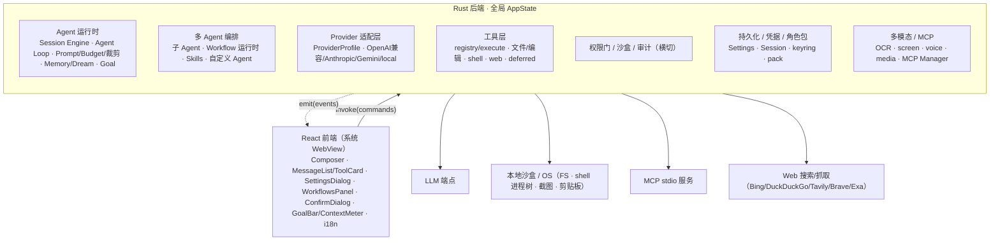
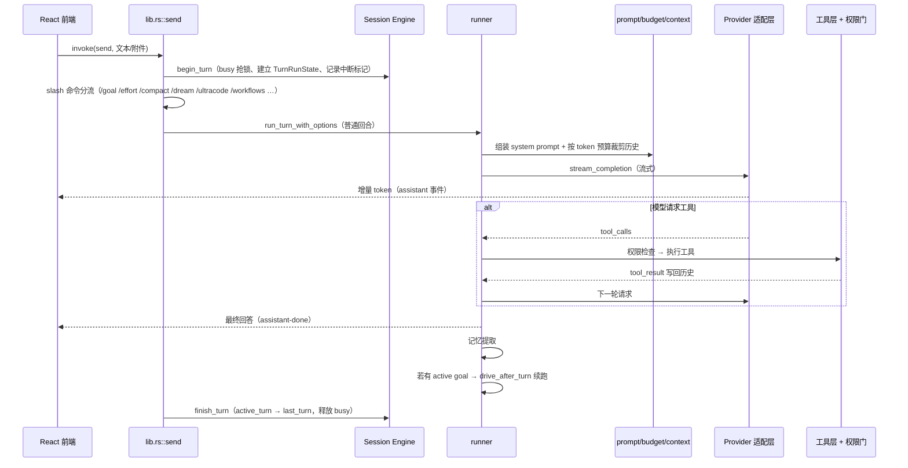

# 架构总览

> 存档级技术原理文档的入口篇。先在这里建立全局心智模型——分层结构、全局状态、命令/事件桥与一次回合的端到端数据流——再按需深入各子系统文档。

## 一、定位与基本取舍

Demiurge 是一个**本地优先**的桌面 Agent 引擎：

- **Rust 内核 + React 外壳。** 全部 Agent 逻辑、工具执行、上下文工程、持久化、系统访问都在 Rust（Tauri 2）后端；前端只负责展示与交互，不承载业务逻辑。两者通过 Tauri 的命令（`invoke`）与事件（`listen`）通信，没有额外的 JS/Python sidecar，也不打包独立 JS 运行时。
- **自带大脑。** 无托管后端、无中继。用户把引擎指向自己的 LLM 端点（在线 OpenAI 兼容、Anthropic、Gemini，或本地兼容网关）。
- **角色与引擎分离。** 引擎通用；persona、记忆、头像/语音等素材由用户导入的角色包提供。
- **可控安全。** 文件工具被物理限制在沙盒目录；写文件、shell、打开路径、截图/OCR、读剪贴板等敏感动作走确认门；密钥存系统凭据管理器而非明文配置。

## 二、分层结构



横切关注点（权限门、沙盒、审计、上下文预算、持久化）不属于某一个簇，而是贯穿工具层与运行时——它们决定了"能不能做"和"做了之后留下什么痕迹"。

## 三、全局状态 AppState

后端围绕一个全局 `AppState`（`src-tauri/src/lib.rs`）组织，由 Tauri 在启动时 `manage`，所有 `#[tauri::command]` 通过 `State<'_, AppState>` 共享访问。它持有的核心运行时状态大致包括：

- 会话与设置：`SessionStore`、`Settings`（含运行时水合出的内存态 secret）。
- 回合治理：`session_engine`（`active_turn`/`last_turn`）、`busy` / `cancel` 原子标记。
- 编排与权限：workflow 运行时状态、Plan Mode 的 `plan_state`、权限规则与待确认项。
- 外部连接：MCP Manager、provider/HTTP client 等。

> 详见 [18-应用外壳、命令面与构建](18-app-shell-build.md)。

## 四、命令/事件桥

前端经 `src/lib/api.ts` 的 typed 封装与后端交互，分为两个方向：

**命令（前端 → 后端 `invoke`）** 按用途可分为若干类：

| 类别 | 代表命令 |
|------|---------|
| 对话 | `send`、`send_with_agents`、`interrupt` |
| 设置 / 连接测试 | `save_settings`、`provider_check_connection`、`web_search_check_connection`、`webdav_check_connection` |
| 会话 | 列举 / 切换 / 重命名 / 删除会话 |
| 上下文 | `context_panel_state`、`session_engine_state` |
| 工作流 | 列举定义、`run`/`stop`、resume |
| 记忆 / 权限 / Plan | 记忆增删改查、权限规则与审计、`approve_plan` |
| MCP / WebDAV / OCR / 语音 | MCP server 管理、WebDAV 备份、OCR 模型状态/下载、`voice_transcribe`/`voice_synthesize` |

**事件（后端 → 前端 `emit`）**：

- 统一信封 `agent-event`（带 turn context），以及为兼容而保留的 legacy `assistant-*` / `tool-*` 事件——两者**双发**。
- 状态推送：`session-engine-updated`（busy/cancel）、`goal`、`workflow-updated`、`plan`、`confirm`（敏感操作确认往返）等。

> 详见 [17-前端架构](17-frontend-architecture.md) 与 [02-Agent 主循环与 Session Engine](02-agent-loop-session-engine.md)。

## 五、一次回合的端到端数据流



关键设计点：

- **入口互斥**：`begin_turn`/`finish_turn` 在 `send`/`send_with_agents` 外层包裹，防止用户中途切换会话导致写入串台。
- **协作式中断**：`interrupt` 置 cancel 标记并把状态推进到 `Cancelling`，runner 在安全点检查后退出，同时唤醒所有待确认项按拒绝处理。
- **system prompt 每轮重建**：会话历史不持久化 system 消息；persona、skills、项目指令、环境、goal、summary、记忆每轮动态拼装。
- **续跑闭环**：若当前会话有 active goal，普通回合结束后自动调度下一轮，直到完成/暂停/阻塞/超预算/超回合/被中断。

## 六、运行时数据目录

应用数据目录由 Tauri `app_data_dir` 决定，主要内容：

```text
app_data_dir/
├─ settings.json                 # 非密钥设置（密钥引用置空）
├─ sessions.json                 # 多会话、active session、rolling summary、goal state
├─ permissions.json              # 项目级权限规则
├─ permission_audit.jsonl        # 轻量权限审计（不落敏感参数）
├─ memory/user.md                # user-scope 手动记忆
├─ skills/*/SKILL.md             # global skills
├─ ocr-models/                   # 本地 OCR 模型
├─ packs/                        # 用户角色包（可含 pack memory / pack skills）
└─ sandbox/                      # 文件工具唯一可访问的工作区
   └─ .demiurge/
      ├─ memory.md               # project-scope 记忆
      ├─ session-memory/*.md     # session-scope 记忆
      ├─ skills/*/SKILL.md       # project skills
      ├─ agents/*.json           # 自定义 Agent / team 定义
      ├─ plans/*.md              # Plan Mode 生成的待批准实施计划
      ├─ workflows/*.json        # workflow 定义
      └─ workflow-runs/<run_id>/ # journal.jsonl（事件流）+ state.json（durable 快照）
```

API Key、WebDAV 密码、Web Search adapter key（Tavily/Brave/Exa）和 MCP secret env 都存系统凭据管理器，不写入 `settings.json` 或 WebDAV 备份；兼容迁移会把旧版明文转存进 keyring，运行时再水合出内存态 secret。

> 详见 [13-持久化、凭据与连接测试](13-persistence-config.md) 与 [12-权限模型与安全边界](12-permission-security.md)。

## 七、子系统导航

完整模块清单与一句话定位见 [本目录索引](README.md)。按职责归簇：

- **Agent 运行时**：[02](02-agent-loop-session-engine.md) · [03](03-context-engineering.md) · [04](04-memory-system.md) · [05](05-goal-driving.md)
- **编排**：[06](06-multi-agent-orchestration.md) · [07](07-workflow-runtime.md) · [08](08-skills-system.md)
- **模型接入**：[09](09-llm-providers.md)
- **工具与安全**：[10](10-tool-system-files.md) · [11](11-tools-shell-web.md) · [12](12-permission-security.md)
- **持久化与素材**：[13](13-persistence-config.md) · [14](14-pack-system.md)
- **多模态与外部协议**：[15](15-multimodal-computer-use.md) · [16](16-mcp-integration.md)
- **外壳**：[17](17-frontend-architecture.md) · [18](18-app-shell-build.md)
