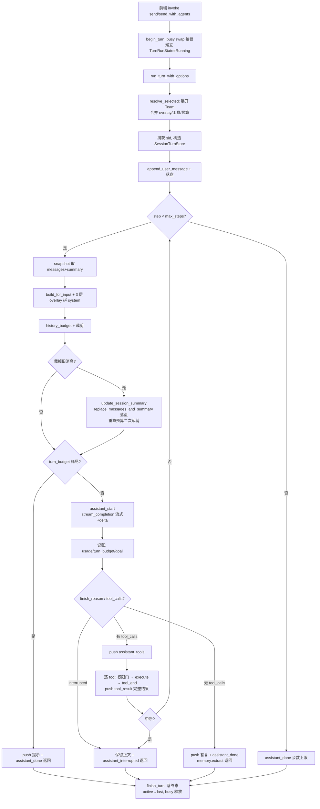

# Agent 主循环与 Session Engine

> 存档级技术原理文档。覆盖一次回合（turn）从入口互斥、状态建立、流式生成、多轮工具循环到收尾的完整生命周期。
>
> 主要源文件：
> - `src-tauri/src/agent/runner.rs`（Agent 主循环，本系统的心脏）
> - `src-tauri/src/agent/session_engine.rs`（回合运行时状态、入口互斥、中断标记、事件信封、会话写入封装）
> - `src-tauri/src/agent/conversation.rs`（OpenAI 兼容的消息结构）
> - `src-tauri/src/agent/mod.rs`（模块导出）
>
> 相邻协作模块：`agent/budget.rs`、`agent/context.rs`、`agent/custom.rs`、`agent/prompt.rs`、`agent/summary.rs`、`agent/goal.rs`、`agent/workflow_journal.rs`、`llm/mod.rs`、`src-tauri/src/lib.rs`（Tauri command 入口）。

---

## 一、模块职责与定位

这个子系统是 Demiurge 把「一条用户输入」转化为「一段带工具调用的多轮对话」的执行核心。它被拆成两层职责清晰的部分：

1. **Session Engine（`session_engine.rs`）—— 运行时治理层。**
   它不关心模型怎么回答，只负责：谁能进入回合（入口互斥）、回合处于什么状态（`TurnStatus` 状态机）、用户是否请求中断（cancel 标记）、过程事件如何对外广播（`TurnEventEmitter` 的双发信封），以及会话历史如何安全读写并落盘（`SessionTurnStore`）。
   按 `session_engine.rs:1`-`5` 的注释，它的设计目标是把「原先散落在各个 Tauri command 入口里的 busy/cancel 状态」收敛成一个可查询、可扩展的运行时状态，同时**第一阶段保持既有事件协议不变**——这解释了后文「legacy 与统一 agent-event 双发」的存在原因。

2. **Runner（`runner.rs`）—— 回合执行层。**
   它实现真正的 Agent 循环（`runner.rs:1`-`2`）：`输入 + 上下文 → 调 LLM → 若请求工具则执行 → 把 tool_result 喂回 → 重复，直到给出最终答复`。它消费 Session Engine 提供的能力（`SessionTurnStore` 读写、`TurnEventEmitter` 广播、`state.cancel` 中断标记），并把预算、裁剪、权限门、流式增量缝合在一起。

两层的**调用边界**在 `src-tauri/src/lib.rs` 的 Tauri command 中：`send`（`lib.rs:293`）和 `send_with_agents`（`lib.rs:458`）负责 `begin_turn` → `run_turn(_with_options)` → `finish_turn` 的外层包裹，而 runner 只负责中间那段。

```
前端 invoke("send" / "send_with_agents")
        │
        ▼
lib.rs::send / send_with_agents          ← 外层：入口互斥 + 状态收尾
        │  begin_turn (busy 抢锁，建立 TurnRunState)
        ▼
agent::run_turn_with_options (runner.rs) ← 中层：回合执行
        │  多轮 LLM ↔ tool-call loop
        ▼
finish_turn (落地 status，释放 busy)
```

---

## 二、关键类型与入口函数

### 2.1 消息模型（`conversation.rs`）

`Message`（`conversation.rs:25`-`36`）是一条 OpenAI 兼容消息，`role ∈ {system, user, assistant, tool}`。四个可选字段全部用 `#[serde(skip_serializing_if = "Option::is_none")]` 修饰，确保发给 provider 时不出现多余 `null`：

| 字段 | 用途 |
|------|------|
| `content` | 文本正文 |
| `tool_calls` | assistant 发起的工具调用列表（`Vec<ToolCall>`） |
| `tool_call_id` | tool 结果消息回指的调用 id |
| `name` | tool 结果消息携带的工具名 |

构造器约定了四类消息的"形状"：`Message::user` / `system` / `assistant_text` / `assistant_tools(content, calls)` / `tool_result(call_id, name, result)`（`conversation.rs:38`-`81`）。

`ToolCall`（`conversation.rs:15`-`21`）的 `function.arguments` 是**一段 JSON 字符串**而非对象（OpenAI 规范如此），因此 runner 在执行前需要 `serde_json::from_str` 再解析（`runner.rs:453`-`454`）。

一个关键设计：`Conversation`（`conversation.rs:84`-`87`）**不含 system 消息**。注释明确说明 system 由 persona 每轮动态拼装、不持久化（`conversation.rs:83`）。这是后文「每轮重建 system prompt」的根因。

### 2.2 回合运行时状态（`session_engine.rs`）

- **`TurnStatus`**（`session_engine.rs:17`-`25`）：状态机枚举 `Running / Cancelling / Completed / Interrupted / Failed`，序列化为 snake_case。
- **`TurnEntrypoint`**（`session_engine.rs:27`-`32`）：区分 `Send` 与 `SendWithAgents` 两个入口。
- **`TurnRunState`**（`session_engine.rs:34`-`47`）：单个回合的全量元数据——`id`、`session_id`、`entrypoint`、`status`、`input_preview`、`workflow_run_id`、`agent_names`、`started_at/updated_at/completed_at`、`error`。
- **`SessionEngineState`**（`session_engine.rs:49`-`53`）：运行时只保留 `active_turn` 与 `last_turn` 两个槽位，存在 `state.session_engine: Mutex<...>`（`lib.rs:52`）。
- **`SessionEnginePanelState`**（`session_engine.rs:55`-`61`）：对前端暴露的快照，叠加了 `busy` 与 `cancel_requested` 两个原子标记的当前值（`panel_state`，`session_engine.rs:251`-`259`）。

### 2.3 回合执行入口（`runner.rs`）

- `run_turn`（`runner.rs:138`）：默认参数的薄封装，转发到 `run_turn_with_options`。
- `run_turn_with_options`（`runner.rs:146`）：真正的主循环，接收 `TurnOptions`。
- `TurnOptions`（`runner.rs:129`-`136`）：携带 `system_overlay`、`stored_user_text`、`workflow_run_id`、`agent_names`、`token_budget`。这是 slash 命令（`/goal`、`/ultracode`、`/workflow resume`）和多 Agent 模式向 runner 注入差异化行为的统一通道。

两个核心常量（`runner.rs:16`-`19`）：
- `UI_RESULT_CAP = 2000`：单个工具结果**回传前端展示**时的最大长度（完整结果仍会进上下文喂回模型）。
- `MAX_STEPS = 16`：一轮内最多的工具往返次数，防止模型死循环。

---

## 三、核心数据流与算法

### 3.1 外层：入口互斥与状态收尾（`lib.rs` + `session_engine.rs`）

一次回合的最外层由 `begin_turn` / `finish_turn` 夹住。

**`begin_turn`（`session_engine.rs:261`-`295`）的互斥语义**靠一个原子 `swap` 实现：

```rust
if state.busy.swap(true, Ordering::SeqCst) {
    return Err("正在处理上一条消息，请稍候。".to_string());
}
```

`swap(true)` 返回旧值，若旧值已是 `true` 说明上一轮还在跑，直接拒绝。抢锁成功后立即把 `state.cancel` 复位为 `false`（`session_engine.rs:270`），建立 `TurnRunState`（状态置 `Running`，写入 `input_preview` 等元数据），放进 `active_turn`，并通过 `emit_update` 广播 `session-engine-updated` 事件（`session_engine.rs:335`-`337`）。

> 注意：runner 入口 `run_turn_with_options` 内部**也**会 `state.cancel.store(false, ...)`（`runner.rs:152`）。这是一处冗余但无害的复位——因为 runner 既可被 command 包裹调用（已复位过），也可能被 goal/workflow 等路径直接调用。

**`finish_turn`（`session_engine.rs:297`-`319`）** 用 `handle.id` 比对当前 `active_turn`，确认是同一回合后写入终态 `status/error/completed_at`，并把 `active_turn` 整体搬到 `last_turn`，最后 `state.busy.store(false)` 释放互斥锁、再次广播。id 比对避免了"回合 A 收尾时误伤已被回合 B 覆盖的状态槽"。

外层 command 如何决定终态？以 `send` 为例（`lib.rs:445`-`453`）：

```
cancel 置位 → Interrupted
否则 res.is_ok() → Completed
否则 → Failed
```

**`request_interrupt`（`session_engine.rs:321`-`333`）** 是中断的写入点：把 `state.cancel` 置 `true`，并把 `active_turn` 的状态从 `Running` 推进到 `Cancelling`（仅当当前为 `Running`），再广播。它由 Tauri command `interrupt`（`lib.rs:505`-`513`）调用——后者还会立刻 drain `state.pending_confirms`，给所有正在 await 的权限确认回送 `deny_once()`。这一步至关重要：否则确认弹窗的 `await` 最长会把整轮卡住 5 分钟（见 `lib.rs:508` 注释）。

### 3.2 中断标记的传播模型

中断是一个**协作式（cooperative）**取消，没有强制 kill 线程，而是依赖 `state.cancel: AtomicBool` 在循环的多个检查点被轮询。runner 中的检查点（均为 `Relaxed` 读）：

| 位置 | 行为 |
|------|------|
| 每个 step 顶部（`runner.rs:228`） | 置位则发 `assistant_interrupted` 并 `break` |
| 摘要更新前（`runner.rs:256`） | 避免在中断后还浪费一次摘要 LLM 调用 |
| 流式生成中（由 `llm::stream_completion` 内部轮询 `&state.cancel`，`runner.rs:339`） | 提前结束流，返回 `finish_reason == "interrupted"` |
| 每个工具执行前（`runner.rs:444`） | 不再执行，但**仍补一条** `[已被用户中断，未执行]` 的 tool 结果 |
| 权限门内（confirm 被 drain 唤醒，返回 deny-once） | 转化为 deny |
| 工具循环结束后（`runner.rs:590`） | 补齐配对后整轮返回 |

**为什么中断时也要补 tool 结果？**（`runner.rs:438`-`451`、`runner.rs:589`-`601`）：带 `tool_calls` 的 assistant 消息一旦入历史，OpenAI 兼容协议要求**每一个 tool_call 都必须配一条 tool 结果消息**，否则下一轮请求会因配对缺失被 provider 判 400。所以即便中断，也要为剩余调用塞占位结果以保持配对完整性。

### 3.3 回合主循环逐阶段拆解（`run_turn_with_options`）

#### 阶段 0：设置与 Agent 解析（`runner.rs:152`-`225`）

1. 复位 cancel、构造 `TurnEventEmitter`（`runner.rs:152`-`153`）。
2. clone 一份 `settings`，`ensure_initialized` 触发 MCP 初始化（`runner.rs:155`-`156`）。
3. `custom::resolve_selected(state, &options.agent_names)`（`runner.rs:157`）解析选中的自定义 Agent / Team，返回 `ResolvedAgents`。
4. **预算与步数合并**（`runner.rs:158`-`175`）：
   - `max_input_tokens` 取 `settings` 与 agent 限制的 `min`；
   - `reserved_output_tokens` 取三者 `min`：settings、agent 限制、`max_input_tokens - 512`（保证历史预算非负）；
   - `max_steps` 取 `agent.max_steps.unwrap_or(MAX_STEPS).min(MAX_STEPS)`——agent 只能调小、不能突破 16 的硬上限；
   - `turn_budget` 优先用 `options.token_budget`（由 `/goal +Nk` 等注入），否则用 agent 的 `max_total_tokens` 构造一个 `TokenBudgetState`。
5. `custom::record_runtime_start` 记录 agent 运行起点（`runner.rs:176`）。
6. **捕获目标会话 id**（`runner.rs:178`）：`let sid = state.sessions.lock().unwrap().active.clone();`，并用它构造 `SessionTurnStore`。注释（`runner.rs:177`）点明设计意图——即便用户中途切换会话，本轮所有写入都落到这一段对话，不会串台。
7. 加载当前角色包 persona 文本（`runner.rs:182`-`186`）。
8. **工具 schema 选择**（`runner.rs:187`-`199`）：
   - provider 不支持工具 → `profile.empty_tool_schema()`；
   - agent 未限制工具 → 全量主 schema `main_schemas_json_for_state`；
   - agent 限制了工具 → 仅按白名单 `schemas_json_for_names_state`。
   schema 方言（OpenAI / Anthropic / Gemini）由 `profile.tool_schema_dialect` 决定。
9. 追加用户消息：`session_store.append_user_message(stored_user_text)`（`runner.rs:225`）。若标题仍为默认值 `"新对话"`，顺手用首条用户消息派生标题（`session_engine.rs:147`-`154`）。

#### 阶段 1：每个 step 内重建上下文（`runner.rs:227`-`308`）

循环 `for _step in 0..max_steps`。每个 step 都**从零重建 system prompt 与请求消息**，原因正是 system 不持久化、且会话摘要可能在上一 step 被滚动更新。

1. **快照**：`session_store.snapshot()`（`runner.rs:234`）返回当前 `(messages, summary)` 的 clone。
2. **拼装 system**：`prompt::build_for_input(state, settings, persona_text, summary, original_user_text)`（`runner.rs:236`），再依次叠加三层 overlay（`apply_system_overlay`，`runner.rs:622`-`631`，以 `\n\n---\n临时任务指令：\n` 分隔）：
   - Plan Mode overlay（仅当 `permission_mode == Plan`，`runner.rs:243`）：限制只能用只读工具 + `write_plan`（文案见 `plan_mode_overlay`，`runner.rs:618`-`620`）；
   - agent 的 `prompt_overlay`（`runner.rs:246`）；
   - `options.system_overlay`（`runner.rs:247`，承载 `/goal`、`/ultracode`、`/workflow resume` 注入的指令）。
3. **计算预算 + 裁剪历史**（`runner.rs:248`-`254`）：
   `budget::history_budget_for_profile` 算出 `history_budget_tokens`，`context::trim_collect_removed_by_tokens` 就地裁剪 `msgs` 并返回被整条移除的旧消息。

#### 阶段 2：裁剪触发的摘要滚动（`runner.rs:256`-`301`）

若有消息被裁掉且未中断，则调用 `summary::update_session_summary` 把"被移除的旧消息"压缩进会话摘要：

```
removed_messages 非空
   └→ summary::update_session_summary(旧摘要, removed_messages)  ← 一次 LLM 调用
        └→ session_store.replace_messages_and_summary(msgs, new_summary)  ← 持久化收敛点
             └→ 用新摘要重建 system + overlay + 重新计算预算 + 二次裁剪
                  └→ 若二次裁剪又移除了消息 → 再 replace_messages
```

这是一个**两轮裁剪**结构：第一次裁剪后摘要变长可能反过来占用 system 预算，因此重算并允许再裁一次。`should_persist_trim` 标记确保即便摘要更新失败（`if let Ok(...)` 未命中），裁剪结果也会在 `runner.rs:299`-`301` 落盘一次。

> 数据流要点：所有对会话 messages/summary 的修改都通过 `SessionTurnStore` 的方法完成，每个方法内部都调用 `mutate_and_persist`——它在锁内改完后刷新 `updated_at` 并触发 `state.persist_sessions()`（`session_engine.rs:175`-`189`）。这就是「会话读写与持久化收敛」：runner 不直接碰 `state.sessions`，写入与落盘是原子配对的。

#### 阶段 3：组装 full 消息并检查硬预算（`runner.rs:303`-`326`）

`full = [Message::system(system)] + msgs`（`runner.rs:303`-`308`）——system 在这里才被拼到最前面，印证它"每轮临时生成"。

随后检查 `turn_budget.is_exhausted()`（`runner.rs:310`-`326`）：若本轮 token 硬预算耗尽，push 一条 `（已达到本轮 token 硬预算，已停止继续调用模型）` 的 assistant 消息，发 `assistant_done`，记 `token_budget_exhausted` 日志后**直接返回**，不再调用模型。

#### 阶段 4：流式生成（`runner.rs:328`-`375`）

1. `events.assistant_start()`（`runner.rs:328`）。
2. `llm::stream_completion(http, settings, full, tools_schema, on_delta, &state.cancel)`（`runner.rs:331`-`341`）。`on_delta` 闭包对每段增量调用 `delta_events.assistant_delta(delta)`，把 token 实时推给前端。`stream_completion`（`llm/mod.rs:558`）按 `profile.adapter_kind()` 路由到 openai / anthropic / gemini / local 适配器，统一返回 `AssistantTurn { content, tool_calls, finish_reason, usage }`（`llm/mod.rs:55`-`60`）。
3. 错误处理（`runner.rs:344`-`348`）：记 agent 运行错误，发 `assistant_error`（payload 由 `assistant_error_payload` 按错误文案分类成 `llm` / `network` 并附排障 hint，`runner.rs:30`-`67`），返回 `Err`。
4. **用量记账**（`runner.rs:351`-`377`）：
   - `estimated_usage` = full 消息估算 + 回复文本估算（启发式，见 §3.6）；
   - `agent_usage_tokens` 优先取 provider 真实 `usage.total_or_sum()`，否则回退估算，喂给 `custom::record_runtime_usage`；
   - 若有 `turn_budget`，`record_usage_or_estimate` 优先记真实用量、否则记估算（`budget.rs:63`-`75`），并写 `token_budget_used` 日志；
   - `goal::add_provider_usage` 把真实用量计入 goal 统计，返回布尔 `exact_usage_recorded`，决定后续是否需要补估算。

#### 阶段 5：三种回合出口

模型返回后有三条分支：

**(a) 被中断**（`finish_reason == "interrupted"`，`runner.rs:380`-`394`）：保留已生成的部分正文（若非空 push 进历史），记 `run_interrupted` 日志，发 `assistant_interrupted`，返回 `Ok`。

**(b) 无工具调用 → 最终答复**（`runner.rs:397`-`425`）：
push assistant 文本，按需补估算 token，记 `run_done`，发 `assistant_done`。然后**异步抽取记忆**：`memory::extract_and_update`（`runner.rs:414`-`423`）让模型从本轮 user+assistant 文本里提炼可持久化的记忆条目。返回 `Ok`，回合结束。

**(c) 有工具调用 → 进入工具循环**（`runner.rs:427`-`587`），见 §3.4。

#### 阶段 6：步数耗尽（`runner.rs:605`-`615`）

`for` 循环正常走完（达到 `max_steps`）说明模型反复调工具未收敛，发 `assistant_done("（已达到本轮工具调用次数上限）")`，记 `run_stopped { reason: "max_steps" }`，返回 `Ok`。

### 3.4 多轮 tool-call loop（`runner.rs:427`-`603`）

```
模型返回 tool_calls
   │
   ├─ push assistant_tools(content, tool_calls)   ← 先把发起调用的 assistant 消息入历史
   │
   └─ for tc in tool_calls:
        │
        ├─ cancel? → push "[已被用户中断，未执行]" 占位结果, continue
        │
        ├─ 解析 args(JSON 字符串→Value), 取 tool_def / preview / affected_paths
        ├─ events.tool_start(ToolStartEvent{...})   + workflow_journal "tool_started"
        │
        ├─ 权限门 permission::decide_for_mode → Allow / Deny / Ask
        │     └─ Ask: permission::confirm(弹窗 await) → remember_response → 改写 decision
        │
        ├─ 执行:
        │     not allowed & interrupted → "[Interrupted before execution]" (denied)
        │     not allowed               → "[User denied this operation]"   (denied)
        │     allowed                   → tools::execute(...)               (ok/err)
        │            └─ write_plan 成功 → app.emit("plan-updated", ...)
        │
        ├─ 计算 duration_ms / error_hint / source_quality
        ├─ events.tool_end(ToolEndEvent{...})       + workflow_journal "tool_done"
        ├─ 按需补估算 token
        └─ push tool_result(tc.id, name, result)    ← 完整结果进历史；UI 只收截断版
   │
   └─ 工具阶段被中断? → 记 run_interrupted, 发 assistant_interrupted, 返回
   │
   └─ 否则继续下一 step（让模型基于工具结果作答）
```

几个关键设计点：

- **assistant_tools 消息先入历史**（`runner.rs:433`-`436`）：注释（`runner.rs:438`-`439`）强调，正因如此，必须为每一个 tool_call 都补结果，配对不能缺。
- **权限门**（`runner.rs:481`-`533`）：`decide_for_mode` 结合 mode + 默认策略 + 风险给出 `Allow/Deny/Ask`。`Ask` 时弹 `permission::confirm` 等待用户；用户响应后 `remember_response` 记忆作用域，并把 `decision` 改写为 `UserOverride` 来源、记一次 `audit`。中断期间 confirm 的 await 会被 `interrupt` command drain 唤醒成 deny-once。
- **UI 与上下文的双轨结果**（`runner.rs:562` vs `runner.rs:586`）：发给前端的 `ToolEndEvent.result` 用 `truncate_ui`（`UI_RESULT_CAP = 2000`，超出截断并标注总字数，`runner.rs:21`-`28`），但 push 进历史喂回模型的 `tool_result` 用**完整结果**。
- **`write_plan` 副作用**（`runner.rs:544`-`546`）：执行成功后额外 emit `plan-updated`，让计划面板实时刷新。
- **可观测性 hint**：`tool_error_hint`（`runner.rs:69`-`99`）按工具名与错误文案给出可操作排障建议；`source_quality_hint`（`runner.rs:101`-`127`）只对 `web_search`/`web_fetch` 统计返回的源链接数，分级 `strong/limited/none`。

### 3.5 TurnEventEmitter：legacy 与统一 agent-event 双发

`TurnEventEmitter`（`session_engine.rs:192`-`249`）是所有过程事件的唯一出口。每个语义方法（`assistant_start/delta/done/error/interrupted`、`tool_start/tool_end`）最终都走 `emit_legacy_and_unified`（`session_engine.rs:234`-`248`）：

```rust
fn emit_legacy_and_unified<T>(&self, legacy_event: &str, kind: &'static str, payload: T) {
    let _ = self.app.emit(legacy_event, payload.clone());        // ① legacy 通道
    let _ = self.app.emit("agent-event", AgentEventEnvelope {      // ② 统一通道
        kind,
        turn: current_turn_context(self.state),                   // 附 turn 上下文
        timestamp: store::now_millis(),
        payload,
    });
}
```

| 语义事件 | legacy 事件名 | 统一 envelope.kind |
|----------|---------------|--------------------|
| assistant 开始 | `assistant-start` | `assistant_start` |
| 正文增量 | `assistant-delta` | `assistant_delta` |
| 最终答复 | `assistant-done` | `assistant_done` |
| 错误 | `assistant-error` | `assistant_error` |
| 中断 | `assistant-interrupted` | `assistant_interrupted` |
| 工具开始 | `tool-start` | `tool_start` |
| 工具结束 | `tool-end` | `tool_end` |

**为什么双发？** 这是一次「兼容式演进」：旧前端监听离散的 `assistant-*` / `tool-*` 事件（payload 即裸数据）；新前端可改听单一的 `agent-event`，它把所有事件包进 `AgentEventEnvelope`（`session_engine.rs:70`-`79`），额外携带 `turn`（id/session_id/status，由 `current_turn_context` 从 `active_turn` 读取，`session_engine.rs:343`-`355`）和 `timestamp`。这样下游能把每个事件精确归属到某个回合，而无需改动既有 legacy 监听。`emit` 失败用 `let _ =` 吞掉——事件广播是尽力而为，不阻塞主循环。

> 与回合状态广播区分：`session-engine-updated`（`emit_update`，`session_engine.rs:335`-`337`）推送的是 `SessionEnginePanelState`（busy / cancel / active_turn / last_turn），由 `begin_turn`/`finish_turn`/`request_interrupt` 触发，属于"回合级"状态；而 `agent-event` 是"事件级"流。两者互补。

### 3.6 预算与裁剪算法（`budget.rs` + `context.rs`）

**启发式 token 估算**（`budget.rs:77`-`117`）：`estimate_text_tokens` 按"ASCII 4 字符≈1 token、非 ASCII 1 字符≈1 token"近似（`budget.rs:88`）；消息级再叠加 `MESSAGE_OVERHEAD_TOKENS = 8`、每个 tool_call `TOOL_CALL_OVERHEAD_TOKENS = 12`。这是无 tokenizer 依赖的粗估，目的是约束而非精确计费。

**历史预算**（`history_budget_for_profile`，`budget.rs:139`-`172`）：
```
max_input_tokens     = profile.effective_token_budget 的 clamp 结果（≥ MIN_HISTORY_BUDGET_TOKENS*2 = 1024）
reserved_output      = clamp 到 [1, max_input - 512]
occupied             = reserved_output + system_tokens + tools_tokens
history_budget_tokens= max(max_input - occupied, MIN_HISTORY_BUDGET_TOKENS=512)
```
即：先扣掉输出预留、system、tools 三块占用，剩下的给历史，且保底 512 token。`effective_token_budget`（`llm/mod.rs:399`-`404`）会用 provider 已知上限 clamp 用户设置（已知 provider 如 OpenAI 会被 clamp 到 128k/16k；未知 custom endpoint 保留用户值）。

**裁剪算法**（`trim_collect_removed_by_tokens`，`context.rs:72`-`103`）：
1. 若总估算 ≤ 预算，直接返回（不裁）；
2. 否则保留最近 `KEEP_RECENT = 8` 条之外的旧 tool 消息正文截断到 `TOOL_KEEP = 400` 字符；
3. 仍超预算则从头逐条 `remove(0)`，且若头部是 `tool` 角色则连带移除（保持配对完整，`context.rs:97`-`99`），直到达标或仅剩 2 条。
被移除的消息原样返回给 runner，用于喂给摘要滚动（§3.2）。

**回合级硬预算**（`TokenBudgetState`，`budget.rs:24`-`76`）：区分 `used_exact`（provider 真实用量）与 `used_estimated`（估算），`is_exhausted` 当 `used_total ≥ total`。它在 runner 阶段 3 被检查（耗尽即停），在阶段 4 被累加。

### 3.7 send_with_agents 的 overlay / 工具限制 / 预算合并

`send_with_agents`（`lib.rs:458`-`502`）与 `send` 的差别只在于把前端选中的 `agent_names` 透传进 `TurnOptions`，其余 begin/finish/goal-drive 包裹一致。真正的合并逻辑在 `custom::resolve_selected`（`custom.rs:297`-`348`）：

1. **广度优先展开 Team**（`custom.rs:301`-`319`）：用队列处理 `agent_names`，若某 def 是 `Team` 则把其 `members` 入队（受 `MAX_TEAM_DEPTH` 与 `seen` 去重约束），最终得到扁平的 `definitions` 列表。
2. **工具白名单求并集**（`custom.rs:326`-`331`）：所有 agent 的 `allowed_tools` 去重合并 → runner 据此选 schema（§3.1 阶段 0 第 8 点）。
3. **预算求交集（取最严）**（`custom.rs:332`-`337`、`min_assign` `custom.rs:351`-`355`）：`max_input_tokens` / `reserved_output_tokens` / `max_steps` / `max_total_tokens` 全部跨 agent 取 `min`——多个 agent 协作时，最保守的那个限制生效。
4. **prompt overlay 拼接**（`build_overlay`，由 `custom.rs:341` 调用）：把各 agent 的人格/指令拼成一段 overlay，在 runner 阶段 1 作为第二层 overlay 注入。

合并结果 `ResolvedAgents` 回到 runner 后，与用户全局 `settings` 再取一次 `min`（`runner.rs:158`-`170`），保证 agent 只能收紧、不能放宽全局约束。

---

## 四、与其他模块的交互边界

| 协作模块 | 交互内容 |
|----------|----------|
| `lib.rs`（Tauri command） | `send`/`send_with_agents` 包裹 `begin_turn`/`finish_turn`；解析 slash 命令分流到 `dream`/`collapse`/`goal`/`skills`/`ultracode`/`workflow`；回合成功后调 `goal::drive_after_turn` |
| `llm/mod.rs` | `stream_completion` 按 provider profile 路由流式生成；`ProviderProfile` 提供工具支持、schema 方言、token 上限 clamp |
| `agent/prompt.rs` | `build_for_input` 每轮拼装 system（persona + 会话摘要 + 输入相关上下文） |
| `agent/summary.rs` | `update_session_summary` 在裁剪触发时滚动压缩被移除的旧消息 |
| `agent/budget.rs` / `agent/context.rs` | token 估算、历史预算计算、按预算裁剪 |
| `agent/custom.rs` | `resolve_selected` 解析 Agent/Team，合并 overlay/工具/预算；`record_runtime_*` 记 agent 运行统计 |
| `agent/goal.rs` | `add_provider_usage`/`add_estimated_tokens` 记账；回合后 `drive_after_turn` 推进目标 |
| `agent/memory.rs` | 最终答复后 `extract_and_update` 抽取记忆 |
| `agent/workflow_journal.rs` | 携带 `workflow_run_id` 时全程记录结构化日志（run_started/tool_started/tool_done/run_done/run_interrupted/run_stopped/token_budget_*） |
| `tools/` | `execute` 执行工具；`definition_for_state`/`confirmation_preview`/`affected_paths`/`permission_policy_for_state` 提供元数据 |
| `permission/` | `decide_for_mode`/`confirm`/`audit`/`remember_response` 实现工具权限门 |
| `store` | `Session`/`derive_title`/`now_millis`/`persist_sessions`；`PermissionMode::Plan` 触发 plan overlay |
| `mcp` | `ensure_initialized` 在回合开始时确保 MCP 工具就绪 |

---

## 五、安全与权限相关点

1. **入口互斥防并发写**：`busy.swap` 保证同一时刻只有一个回合在跑，避免两轮同时写同一会话历史。
2. **会话 id 锁定**：回合开始即捕获 `sid`（`runner.rs:178`），所有写入绑定这一段对话，用户中途切换会话不会污染目标会话。
3. **逐工具权限门**：每个工具执行前都过 `permission::decide_for_mode`，`Ask` 弹窗等待用户显式授权；所有决策 `audit` 留痕。
4. **Plan Mode 限制**（`runner.rs:243`、`plan_mode_overlay`）：`permission_mode == Plan` 时通过 system overlay 约束模型只能用只读工具与 `write_plan`，批准前不得执行实现。
5. **协作式中断的完整性**：中断时仍补齐 tool 结果配对，既不让 provider 报 400，也不会执行用户已取消的高风险操作；权限弹窗能被中断即时唤醒成 deny。
6. **Agent 只能收紧约束**：自定义 Agent 的工具白名单是子集、预算/步数取 `min`，无法越过全局 `settings` 与 `MAX_STEPS` 硬上限放宽权限。
7. **UI 结果截断**：回传前端的工具结果截断到 2000 字，降低敏感长输出在 UI 层意外泄露/卡顿的风险（完整内容仅在进程内喂回模型）。

---

## 六、已知限制与扩展点

1. **Token 估算是启发式，非精确 tokenizer**（`budget.rs:77`-`89`）：ASCII÷4、非 ASCII×1 的近似在中英混排、代码、特殊符号上会有偏差。预算与裁剪因此是"软约束"，仅在 provider 未回传真实 usage 时作为兜底。
2. **回合级硬预算依赖真实/估算 usage**：`TokenBudgetState` 的耗尽判定累加真实用量（优先）或估算用量（兜底，`budget.rs:63`-`75`）。它**只在每个 step 开头检查**（`runner.rs:310`），即单次流式生成途中不会被硬预算打断——超额发生在"下一次调用前"被拦下，而非"调用中"。这是当前行为，注意不是逐 token 硬约束。
3. **摘要滚动每次裁剪触发一次 LLM 调用**（`runner.rs:257`）：长会话频繁裁剪会带来额外延迟与开销；摘要更新失败时仅持久化裁剪结果、不更新摘要（优雅降级）。
4. **`Cancelling` 状态是过渡态**：`request_interrupt` 把状态推进到 `Cancelling`，但最终落地为 `Interrupted`/`Completed`/`Failed` 由外层 command 在 `finish_turn` 时按 cancel 标记重新判定（`lib.rs:445`-`451`），二者并非同一处写入。
5. **`SessionEngineState` 只保留单 active + 单 last turn**（`session_engine.rs:49`-`53`）：当前不支持并发多回合的运行时视图——这与 §五入口互斥一致，是有意为之；若未来要并发会话，这里是首要扩展点。
6. **"第一阶段"措辞与双发协议**：`session_engine.rs:1`-`5` 自述为"第一阶段保持既有事件协议不变"，legacy 与 `agent-event` 双发是过渡期产物。后续若前端完全切到 `agent-event`，`emit_legacy_and_unified` 的 legacy 分支可下线，属预留收口点。
7. **新增事件类型的扩展路径**：要加一类新事件，在 `TurnEventEmitter` 增一个语义方法 + 一个对应 payload struct 即可，双发与 turn 上下文附着是自动的。
8. **环境变量覆盖**：`llm/mod.rs:439` 读取 `DEMIURGE_EFFORT_LEVEL` 覆盖推理强度，便于本地调试或临时切换模型请求策略。

---

## 附：一次完整回合的数据流总览


