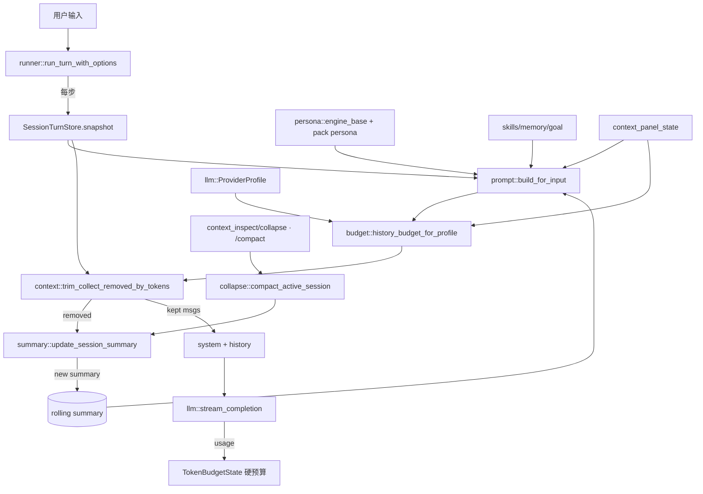

# 上下文工程：Prompt 组装、预算与裁剪

> 存档级技术原理文档。读者为协作开发者。
> 覆盖源文件：
> - `src-tauri/src/agent/prompt.rs`（system prompt 分区组装）
> - `src-tauri/src/agent/budget.rs`（token 启发式估算与 profile-aware history budget）
> - `src-tauri/src/agent/context.rs`（历史裁剪）
> - `src-tauri/src/agent/summary.rs`（rolling summary 更新）
> - `src-tauri/src/agent/collapse.rs` + `src-tauri/src/tools/context_tools.rs`（`/compact`、`context_inspect`/`context_collapse`）
> - `src-tauri/src/lib.rs`（`context_panel_state` 预算可视化聚合）
> 相邻依赖：`src-tauri/src/agent/runner.rs`、`src-tauri/src/llm/mod.rs`、`src-tauri/src/agent/persona.rs`、`src-tauri/src/store/mod.rs`。

---

## 一、模块职责与定位

每一轮 Agent 循环都要把「引擎规则 + 角色人格 + 项目/记忆/摘要/目标/环境 + 安全/工具规约」拼成一个 system prompt 字符串，再叠加一段经过裁剪的历史消息，最后整体喂给 LLM。这个子系统就是这条数据管线的「上下文层」，它要同时解决三个相互冲突的目标：

1. **信息完整**：把对当前回合真正有用的信息塞进窗口；
2. **预算受限**：system prompt 受字符预算约束，历史受 token 预算约束，且要为模型回复预留输出空间；
3. **格式合法**：裁剪历史时不能产生「孤儿 tool 结果」（没有对应 `assistant.tool_calls` 的 `tool` 消息），否则 OpenAI 兼容端会 400。

整体设计采用「两套度量、分层施压」的策略：

- **system prompt** 用**字符预算**（`max_context_chars`）按分区优先级组装，这是 `prompt.rs` 的职责；
- **历史消息** 用**启发式 token 预算**（profile-aware `history_budget_tokens`）裁剪，这是 `budget.rs` + `context.rs` 的职责；
- 被裁掉的旧消息不直接丢弃，而是交给 `summary.rs` 压缩成 **rolling summary**，再作为一个分区回流进下一轮的 system prompt。

注意这两套度量是**独立**的：字符预算只约束 system prompt 文本本身；token 预算才是真正对齐 provider 上下文窗口的约束。`prompt.rs:212` 在生成报告时虽然顺带用 `budget::estimate_text_tokens` 算出每个分区的 token，但分区的「纳入/截断」裁决（`assemble_drafts`）完全由字符数驱动。

---

## 二、关键类型与入口函数

| 类型/函数 | 位置 | 作用 |
|---|---|---|
| `prompt::build_for_input` | `prompt.rs:58` | runner 实际调用的入口，返回最终 system 字符串 |
| `prompt::build_with_report` | `prompt.rs:68` | 面板用入口，返回带逐分区报告的 `PromptBuild` |
| `PromptBuild` / `PromptSectionReport` | `prompt.rs:37` / `prompt.rs:25` | 组装结果与逐分区统计（chars/tokens/included/truncated） |
| `budget::estimate_text_tokens` | `budget.rs:77` | 文本 token 启发式估算 |
| `budget::history_budget_for_profile` | `budget.rs:139` | profile-aware 预算计算，产出 `ContextBudget` |
| `budget::ContextBudget` | `budget.rs:15` | 一轮请求的预算账本（system/tools/history/reserve） |
| `budget::TokenBudgetState` | `budget.rs:25` | 跨步累计 token 用量的「硬预算」状态（精确/估算） |
| `context::trim_collect_removed_by_tokens` | `context.rs:72` | 按 token 预算裁剪历史，返回被整条移除的旧消息 |
| `summary::update_session_summary` | `summary.rs:13` | 把被裁剪旧消息压缩进 rolling summary |
| `collapse::compact_active_session` | `collapse.rs:69` | `/compact` 与 `context_collapse` 的共享内核 |
| `collapse::inspect` / `ContextStats` | `collapse.rs:18` / `collapse.rs:10` | `context_inspect` 的数据来源 |
| `ContextPanelState` + `context_panel_state` | `lib.rs:117` / `lib.rs:1012` | 前端预算可视化的聚合命令 |
| `ProviderProfile::effective_token_budget` | `llm/mod.rs:399` | 把用户设置 clamp 到 provider 窗口 |

---

## 三、System Prompt 的分区组装

### 3.1 分区定义与两个不同的「优先级」

`build_ordered_sections`（`prompt.rs:103`）按**固定的声明顺序**构造 9 个 `SectionDraft`，每个带一个 `priority: u8`：

| id | 标题 | priority | 内容来源 |
|---|---|---|---|
| `pack_persona` | Pack Persona | 90 | 当前角色包人格文本（runner 从 `pack::load_pack` 取） |
| `skills` | Skills | 60 | `skills::context_for_turn`，按 `user_text` 召回的技能片段 |
| `project_instructions` | Project Instructions | 80 | `DEMIURGE.md`/`SYSTEM.md`/`AGENTS.md`/`README.md` + 包/框架探测 + 目录快照 |
| `memories` | Memories | 75 | `memory::scoped_memory_paths` 各作用域记忆 + `memory.md` 遗留记忆 |
| `conversation_summary` | Conversation Summary | 65 | rolling summary |
| `current_goal` | Current Goal | 70 | `goal::build_goal_context_block` |
| `environment` | Environment | 55 | 时间/OS/sandbox/pack/provider/git status |
| `tools` | Tools | 85 | 静态工具使用规约 |
| `safety_rules` | Safety Rules | 95 | 静态安全红线 |

这里有两个独立的「顺序」概念，理解它们的分工是看懂本模块的关键：

- **声明顺序（输出顺序）**：分区在最终 prompt 文本里的物理顺序，永远等于上表的声明顺序（`assemble_drafts` 第二个循环 `prompt.rs:202` 按 `drafts` 原序输出）。也就是说人格永远在最前、安全规则永远在最后，无论预算松紧。
- **优先级顺序（保留顺序）**：当字符预算不够时，谁先抢占预算。`priority` 越高越先被纳入（`prompt.rs:162` 按 `priority` 降序排序索引；同优先级用原索引升序 tie-break）。

为什么这样设计：把「裁决顺序」和「呈现顺序」解耦，可以保证即使在极限预算下，安全规则（95）和工具规约（85）几乎一定能完整保留，而占用大、可截断的 `project_instructions`（80）、`memories`（75）会被优先牺牲；同时模型读到的 prompt 结构是稳定的，不会因预算波动而段落重排。

> `pack_persona`=90 高于 `tools`=85，意味着角色人格在抢预算上仅次于安全规则；`environment`=55 与 `skills`=60 最低，是预算紧张时最先被压缩的两块。

### 3.2 `engine_base` 是预算之外的固定前缀

`build_with_report_for_input`（`prompt.rs:100`）最终调用 `assemble_drafts(super::persona::engine_base(), drafts, settings.max_context_chars)`。`engine_base()`（`persona.rs:17`，即常量 `ENGINE_BASE`）是「# Demiurge 引擎规则」那段中文基础指令，它**不参与分区裁决**，而是无条件作为 prompt 头部写入，并从预算里先扣掉自身字符数（`prompt.rs:158-159`）：

```rust
let base_chars = char_count(base);
let mut remaining = max_context_chars.saturating_sub(base_chars);
```

也就是说引擎规则是「地基」，分区只能瓜分剩余预算。

### 3.3 `assemble_drafts` 的预算裁剪算法

核心算法在 `assemble_drafts`（`prompt.rs:156`）。逐分区（按优先级降序）做三态裁决：

```
对每个 draft（按 priority 降序）:
    body = trim(draft.body); 空则跳过
    overhead = "\n\n---\n<title>:\n\n" 的字符数          (section_overhead_chars, prompt.rs:250)
    full_cost = overhead + body_chars
    if full_cost <= remaining:
        → 整段纳入，remaining -= full_cost          (完整)
    else if remaining > overhead + MIN_TRUNCATED_SECTION_CHARS(600):
        allowed = remaining - overhead
        → 截断纳入 truncate_with_note(body, allowed)，remaining = 0   (截断)
    else:
        → 整段丢弃（decisions[idx] = None）          (排除)
```

设计要点：

- **`MIN_TRUNCATED_SECTION_CHARS = 600`**（`prompt.rs:22`）：若剩余预算扣掉 overhead 后不足 600 字符，宁可整段丢弃也不塞一段几乎没有信息量的残片。这避免了「截出半句话反而误导模型」。
- **截断只发生一次**：一旦某分区被截断，`remaining` 直接清零（`prompt.rs:195`），后续所有更低优先级分区一律被排除。
- **`truncate_with_note`**（`prompt.rs:580`）在截断尾部追加 `\n[section truncated by prompt budget]` 标记，让模型知道这里被裁过。
- 每个分区在写入前还各自有**硬上限**：`MAX_PROJECT_CHARS=14000`、`MAX_MEMORY_CHARS=8000`（`prompt.rs:18-19`，经 `cap_chars` 应用），即分区内容在进入预算裁决前就已被各自封顶。

最终 `assemble_drafts` 同时产出 `text`（拼好的 prompt）和 `sections: Vec<PromptSectionReport>`（每分区的 chars/original_chars/tokens/included/truncated），供面板展示。

### 3.4 各分区内容采集的工程细节

- **`project_section`**（`prompt.rs:272`）：依次读取指令文件（`DEMIURGE.md`/`SYSTEM.md`/`AGENTS.md`，其中 `DEMIURGE.md`/`SYSTEM.md` 为本项目自有的中性指令文件名，`AGENTS.md` 兼容跨工具的 agents.md 通用约定）、`README.md`、`package_detection`（解析 `package.json` 与 `src-tauri/Cargo.toml` 推断前端/Rust 技术栈）、`directory_snapshot`。单文件读取上限 `MAX_TEXT_FILE_BYTES=32KB`（`read_limited_text`，`prompt.rs:564`，超限直接跳过）。
- **`directory_snapshot`**（`prompt.rs:455`）：递归深度上限 `MAX_DIRECTORY_DEPTH=2`、条目上限 `MAX_DIRECTORY_ENTRIES=90`，并跳过 `.git`/`node_modules`/`target`/`dist`/`Cargo.lock` 等重目录（`should_skip_entry`，`prompt.rs:504`）；目录先于文件、再字典序，溢出的条目以 `... N entries omitted` 收尾。
- **`environment_section`**（`prompt.rs:322`）含 `git_snapshot`（`prompt.rs:526`），后者在独立线程跑 `git status --short --branch`，用 `mpsc` + `recv_timeout(GIT_TIMEOUT_SECS=5)` 做超时保护，避免大仓库或卡死的 git 阻塞整轮组装。

---

## 四、Token 启发式估算与 Profile-aware History Budget

### 4.1 token 启发式

`estimate_text_tokens`（`budget.rs:77`）是全模块统一的估算函数，规则极简：

```rust
ascii.div_ceil(4) + non_ascii.max(1)
```

即：ASCII 字符按「4 字符≈1 token」向上取整，非 ASCII（主要是 CJK）按「1 字符≈1 token」。`non_ascii.max(1)` 保证非空但全 ASCII 的短串也至少计 0+... （注意 `.max(1)` 作用在 non_ascii 计数上，纯 ASCII 文本 non_ascii=0 时这里会变成 1，属于轻微高估，目的是给极短文本一个保底）。

消息级估算 `estimate_message_tokens`（`budget.rs:91`）在此之上叠加固定开销：每条消息 `MESSAGE_OVERHEAD_TOKENS=8`，每个 tool_call 额外 `TOOL_CALL_OVERHEAD_TOKENS=12`，并把 role/content/tool_call_id/name/tool_calls 各字段文本逐一累加。工具 schema 用 `estimate_tools_tokens`（`budget.rs:119`）对 `tools.to_string()` 整体估算。

这是有意为之的「轻量近似」：真实分词需要 tokenizer 且 provider 各异，这里只求一个**保守、可重复、零依赖**的上界用于裁剪决策；真正精确的用量在拿到 provider `usage` 后会覆盖估算（见 4.4）。

### 4.2 ContextBudget 计算

`history_budget_for_profile`（`budget.rs:139`）是核心：

```
provider_budget = profile.effective_token_budget(settings)        // clamp 到模型窗口
max_input_tokens     = max(provider_budget.max_input_tokens, MIN_HISTORY_BUDGET_TOKENS*2)   // 至少 1024
reserved_output_tokens = clamp(provider_budget.reserved_output, ≤ max_input - 512, ≥ 1)
system_tokens  = estimate_text_tokens(system)
tools_tokens   = estimate_tools_tokens(tools)
history_tokens = estimate_messages_tokens(history)
occupied = reserved_output_tokens + system_tokens + tools_tokens
history_budget_tokens = max(max_input_tokens - occupied, MIN_HISTORY_BUDGET_TOKENS=512)
```

含义：在模型可用输入窗口里，先扣掉「为回复预留的输出空间 + system prompt + 工具 schema」，剩下的才是历史能用的预算，且地板为 512 token，防止 system/tools 过大时历史预算被算成 0 而把整段对话清空。

### 4.3 profile-aware：预算如何对齐各 provider 窗口

`profile.effective_token_budget`（`llm/mod.rs:399`）把**用户设置**与**provider 硬上限**取 `min`：

```rust
effective_max_input_tokens = settings.max_input_tokens.min(profile.max_input_tokens)   // 若 profile 有上限
effective_reserved_output  = settings.reserved_output_tokens.min(profile.max_output_tokens)
```

各 profile 的窗口常量（`llm/mod.rs`）：

| provider | `max_input_tokens` | `max_output_tokens` |
|---|---|---|
| `openai()` | 272_000 | 128_000 |
| `anthropic()` | 200_000 | 64_000 |
| `gemini()` | 1_000_000 | 65_536 |
| `openai_compatible()` / `local` | `None`（不 clamp，沿用用户设置） | `None` |

`Settings` 默认值（`store/mod.rs:12`）：`DEFAULT_MAX_INPUT_TOKENS=32_000`、`DEFAULT_RESERVED_OUTPUT_TOKENS=4_000`、`DEFAULT_MAX_CONTEXT_CHARS=24_000`。因 `effective_*` 取 `min`，对 OpenAI 官方 profile 而言用户填得再大也会被压到 272K/128K；对「OpenAI 兼容」类（`max_input_tokens=None`）则完全信任用户设置，因为这类端点的真实窗口未知。

> **`budget.rs:219` 的测试值溯源**：`history_budget_uses_profile_token_limits` 断言 OpenAI profile 把 500_000/200_000 clamp 到 `128_000`/`16_384`。这与上表 `openai()` 的 272_000/128_000 不符——因为该测试显式传入 `ProviderProfile::openai()` 之外，断言数字其实来自一个旧版常量；`llm/mod.rs:709` 的 `official_openai_profile_clamps_token_budget` 同样断言 128_000/16_384。**这是两处测试常量与当前 `openai()` profile 定义（272K/128K）不一致**，详见第八节「现有文档/测试与代码不符」。

### 4.4 TokenBudgetState：跨步「硬预算」状态机

`TokenBudgetState`（`budget.rs:25`）与上面的 `ContextBudget` 是**两件事**：`ContextBudget` 是每一步重新计算的「窗口分配」，`TokenBudgetState` 是**贯穿整轮多步**的累计用量上限（主要服务于自定义 Agent / 子 Agent 的 `max_total_tokens` 硬约束）。

- `used_total = used_exact + used_estimated`；`remaining()` / `is_exhausted()` 针对可选的 `total`。
- `record_usage_or_estimate`（`budget.rs:63`）：**优先用 provider 返回的精确 usage**（`usage.total_or_sum()`），拿不到才退回本地估算。runner 在每步拿到 `turn` 后调用它（`runner.rs:360`），并在下一步开头检查 `is_exhausted()`，命中则以「（已达到本轮 token 硬预算，已停止继续调用模型）」收尾（`runner.rs:310-326`）。
- `turn_budget` 的来源：`TurnOptions.token_budget` 或 `selected_agents.max_total_tokens`（`runner.rs:171`）。**普通用户回合（无自定义 Agent 预算）时 `turn_budget` 为 `None`，这条硬约束不生效**——它当前只对显式设置了总预算的 Agent 编排路径起作用。

---

## 五、历史裁剪：`trim_collect_removed_by_tokens`

### 5.1 两阶段裁剪策略

`context.rs` 提供两个孪生函数：`trim_collect_removed`（按字符，`context.rs:25`）与 `trim_collect_removed_by_tokens`（按 token，`context.rs:72`）。runner 实际使用的是后者（`runner.rs:250`），前者及无返回值的 `trim`（`context.rs:63`）标注了 `#[allow(dead_code)]`，是历史遗留/字符近似版本。两者算法结构完全一致，仅度量函数不同（`total_tokens` 用 `budget::estimate_messages_tokens`）。

算法（`KEEP_RECENT=8`、`TOOL_KEEP=400`）：

```
if total_tokens(msgs) <= max_tokens: return []        // 未超预算，零裁剪

// 阶段一：截断「较老的」超长 tool 结果，保留最近 KEEP_RECENT=8 条不动
if msgs.len() > 8:
    for m in msgs[0 .. len-8]:
        if m.role == "tool" and m.content.len() > TOOL_KEEP=400:
            m.content = head(400) + "…[已截断更早的工具输出]"

// 阶段二：仍超预算 → 从最旧整条丢弃
while total_tokens(msgs) > max_tokens and msgs.len() > 2:
    removed.push(msgs.remove(0))
    while msgs.first().role == "tool":            // 清理孤儿 tool 结果
        removed.push(msgs.remove(0))
return removed
```

### 5.2 三个关键设计决策

1. **先砍工具输出，再丢回合**：工具结果（尤其是文件读取、shell 输出）往往是上下文里最臃肿且时效性最差的部分。阶段一只截断「老的」（`len-8` 之前）且「超长」（>400 字符）的 tool 内容，最近 8 条完全不动，保住近端交互的连贯性。`TOOL_KEEP` 用的是 `c.len()`（字节）而非字符数——对纯 ASCII 工具输出（绝大多数）等价，对含中文的输出会偏严格一点。

2. **孤儿 tool 结果清理**：阶段二每丢掉一条最旧消息后，会用内层 `while` 把开头连续的 `tool` 消息一并丢掉（`context.rs:97-99`）。原因写在 `context.rs:24` 的注释里——`tool` 消息必须紧跟在带 `tool_calls` 的 `assistant` 消息之后，否则下一轮请求会因「配对缺失」被 OpenAI 兼容端判 400。这是**结构合法性约束**，不是优化。

3. **下界保护 `msgs.len() > 2`**：永远至少保留 2 条消息，避免把历史清空到模型完全失忆。

### 5.3 在 runner 中的「裁剪 → 摘要 → 再裁剪」回路

`run_turn_with_options`（`runner.rs:227` 起）每一步都重建上下文，关键序列（`runner.rs:234-301`）：

```
1. snapshot 取 (msgs, session_summary)
2. system = prompt::build_for_input(..., session_summary, original_user_text)   // 摘要进 prompt
   + 叠加 plan_mode / agent / 临时 overlay（apply_system_overlay）
3. current_budget = history_budget_for_profile(settings, profile, system, tools_schema, msgs)
4. removed = trim_collect_removed_by_tokens(msgs, current_budget.history_budget_tokens)
5. 若 removed 非空：
     next_summary = summary::update_session_summary(existing=session_summary, removed)
     替换 session 的 messages+summary，并【用新摘要重建 system】、【重算 budget】、【再裁剪一次】
6. should_persist_trim 时把裁剪后的 msgs 落库
7. full = [system] + msgs，调用 llm::stream_completion
```

为什么要「再裁剪一次」（`runner.rs:288`）：摘要更新后 system prompt 里多了 `conversation_summary` 分区，system_tokens 变大 → `history_budget_tokens` 收缩，原本刚好卡线的历史可能再次越界，所以必须用新预算重新裁一遍，保证最终送出的 `system + history` 真正落在窗口内。这是一个最多两轮的不动点逼近，而非无限循环。

注意摘要更新是 `async` 且依赖 provider，runner 用 `if let Ok(next_summary) = ...await` 容错：摘要调用失败时不阻断本轮，仅维持旧摘要并继续（裁剪后的 msgs 仍已落库）。

---

## 六、Rolling Summary 更新

`summary::update_session_summary`（`summary.rs:13`）把「被裁剪的旧消息」增量压缩进一段会话级摘要。

数据流：

```
removed_messages → compact_messages(扁平化为 role(name): content / [tool_calls: ...] 文本)
                 → 上限 MAX_REMOVED_CHARS=12000 截断
现有摘要 existing_summary（缺省「（暂无）」）+ removed_text
                 → 填入固定中文 prompt 模板（summary.rs:34）
                 → 以 [system: 摘要器, user: prompt] 调 llm::stream_completion（tools=[]）
                 → 输出经 cap_chars 封顶 MAX_SUMMARY_CHARS=6000
```

提前返回的护栏（`summary.rs:21`）：`removed_messages` 为空、provider 需要 key 但 key 为空、或已被 `cancel` 置位时，直接返回原摘要不做任何网络调用。摘要生成过程中若被中断或 `finish_reason=="interrupted"`（`summary.rs:59`），同样回退旧摘要。空输出也回退旧摘要。

设计意图：摘要是「有损但单调有用」的——prompt 模板（`summary.rs:35`）明确要求只保留对后续有用的事实（用户偏好、明确要求、架构/实现决策、未完成事项、关键文件/命令/错误），删除寒暄与无关细节，且**不要编造**。摘要本身又会作为 `conversation_summary` 分区（priority=65）回流进 system prompt，形成「越裁越浓缩」的滚动状态。

`MAX_REMOVED_CHARS`/`MAX_SUMMARY_CHARS` 用 `chars().count()` 计数（`cap_chars`，`summary.rs:105`），对中文友好，超限尾部追加 `\n…[已截断]`。

---

## 七、手动折叠：`/compact`、`context_inspect`、`context_collapse`

自动裁剪是「被动触顶才发生」，本模块还提供**主动折叠**，让用户/模型在接近上限前提前释放空间。

### 7.1 共享内核 `compact_active_session`

`collapse::compact_active_session(state, keep_recent)`（`collapse.rs:69`）：

```
1. 校验 provider key（需要 key 但缺失 → Err）
2. split_at = messages.len() - keep_recent；若 0 → 无需折叠，返回 removed=0
3. removed = drain_prefix_preserving_pairs(messages, split_at)
      // 先 drain 前缀，再把开头残留的孤儿 tool 结果一并移除（collapse.rs:128）
4. next_summary = summary::update_session_summary(existing, removed)
5. 写回 session.summary，persist_sessions()
6. 返回 CompactResult { removed_messages, after: inspect(state) }
```

与自动裁剪的差异：自动裁剪是 token-budget 驱动的「截断+丢弃」混合策略；折叠是**按条数**（保留最近 `keep_recent` 条）的「整体前缀切除 + 摘要」，更干脆，且总会触发一次摘要。`drain_prefix_preserving_pairs` 复用了与 `context.rs` 相同的孤儿 tool 清理思想。

### 7.2 `/compact` slash 命令

入口在 `lib.rs:313`（`send` 分发里）：`/compact [keep=N]` → `collapse::run_manual_compact`（`collapse.rs:37`）。`parse_keep_recent`（`collapse.rs:137`）从文本里抽 `keep=` 整数，要求 `>= 2`（否则忽略，回退默认 `MANUAL_KEEP_RECENT=12`）。结果以一条 assistant 消息回显折叠了多少条、保留多少条、当前消息数与摘要字数。

### 7.3 工具形式 `context_inspect` / `context_collapse`

`tools/context_tools.rs` 是工具层薄封装：

- `context_tools::inspect`（`context_tools.rs:9`）→ `collapse::inspect` 序列化为 JSON。`ContextStats`（`collapse.rs:10`）含 `message_count` / `summary_chars` / `estimated_history_tokens`（= `budget::estimate_messages_tokens`）/ `compactable_messages`（= `len - MANUAL_KEEP_RECENT(12)`，下溢饱和到 0）。
- `context_tools::collapse`（`context_tools.rs:13`）→ 解析 `keep_recent`（默认 12、最小 2）→ `compact_active_session`。

工具定义在 `tools/mod.rs:532`：`context_inspect` 是 `ReadOnly`/`ParallelSafe`/`allow`；`context_collapse` 是 `External`/`SerialOnly`/`ask`（会调摘要模型并改写历史，故默认需确认，确认预览见 `tools/mod.rs:1035`）。子 Agent 默认工具白名单包含 `context_inspect`（`subagent.rs:25`），`ultracode` 编排提示也建议长任务用 `context_inspect`/`context_collapse` 管理上下文（`ultracode.rs:18`）。

---

## 八、预算可视化：`context_panel_state`

前端上下文面板的数据由 Tauri 命令 `context_panel_state`（`lib.rs:1012`）一次性聚合，结构体 `ContextPanelState`（`lib.rs:117`）。它**不复用 runner 的运行态**，而是用当前会话快照重新跑一遍组装与预算，得到「如果现在发起一轮请求会是什么预算分布」的快照。

聚合流程：

```
1. 取当前会话 (messages, summary)
2. persona_text ← pack::load_pack
3. prompt_build = prompt::build_with_report(state, settings, persona_text, summary)   // 注意：无 user_text
4. tools_schema = profile 支持工具 ? main_schemas_json_for(dialect) : empty_tool_schema()
5. budget = budget::history_budget(settings, prompt_build.text, tools_schema, messages)
6. 派生指标：
     input_budget_used_tokens      = system + tools + history
     input_budget_remaining_tokens = max_input - used
     projected_total_tokens        = used + reserved_output
     history_remaining_tokens      = history_budget - history
     history_over_budget_tokens    = history - history_budget   (饱和减)
7. budget_items / history_buckets / memory_sources / prompt_sections
```

各可视化数据来源（务必区分「估算」与「精确」）：

| 面板字段 | 来源 | 备注 |
|---|---|---|
| `system_prompt_chars` | `prompt_build.prompt_chars` | 字符数（含 engine_base） |
| `system_prompt_tokens` | `budget.system_tokens` | 启发式估算 |
| `tools_tokens` | `budget.tools_tokens` | 对 tools schema 序列化估算 |
| `estimated_history_tokens` | `budget.history_tokens` | **裁剪前**的全量历史估算 |
| `history_budget_tokens` | `budget.history_budget_tokens` | 当前窗口给历史的额度 |
| `history_over_budget_tokens` | `history - history_budget`（饱和） | >0 表示下一轮会触发裁剪 |
| `max_input_tokens` / `reserved_output_tokens` | profile clamp 后 | profile-aware |
| `budget_items` | `context_budget_items`（`lib.rs:1101`） | system/tools/history/output_reserve 四项 |
| `history_buckets` | `context_history_buckets`（`lib.rs:1136`） | 按 role 分桶计数/估算 token |
| `memory_sources` | `context_memory_sources`（`lib.rs:1169`） | 各记忆文件存在性/字符/token/条目数 |
| `prompt_sections` | `prompt_build.sections` | 逐分区 chars/tokens/included/truncated |

两个易被误解的点：

- `context_panel_state` 调 `build_with_report`（无 `user_text`），而 runner 调 `build_for_input`（带 `original_user_text`）。`user_text` 仅影响 `skills` 分区的召回（`skills::context_for_turn`），所以面板里 skills 分区可能与真实回合略有出入。
- 面板展示的是**裁剪前**的 `history_tokens`，配合 `history_over_budget_tokens` 提示「超了多少、下一轮会被裁多少」，而不是裁剪后的真实送出量。

---

## 九、与其他模块的交互边界



- **runner**（`runner.rs`）是唯一的实时消费者，串起组装→预算→裁剪→摘要→请求。
- **llm/mod.rs** 提供 `ProviderProfile`（窗口/方言/能力），是预算 profile-aware 的来源；`stream_completion` 是摘要器与主回合共用的调用入口。
- **store**（`Settings`）提供 `max_context_chars`/`max_input_tokens`/`reserved_output_tokens` 与各默认常量。
- **persona / skills / memory / goal / pack** 提供各分区原料。
- **session_engine::SessionTurnStore** 负责 messages + summary 的读取/替换/持久化（裁剪后落库即经由它）。

---

## 十、安全与权限相关点

- **凭据红线**：`safety_section`（`prompt.rs:343`，priority=95）在预算极限下仍几乎必然保留，明确禁止泄露/持久化 API key、token、凭据；并要求坚守 sandbox 边界、信任工具真实输出。
- **沙盒边界**：`engine_base`（`persona.rs`）声明文件/搜索/shell 工具被「物理限制」在沙盒内——是结构性限制而非提示约束。环境分区里也回显 `Workspace sandbox` 路径。
- **`context_collapse` 需确认**：它会调用模型并改写会话历史与摘要，故被定为 `External` 风险、默认 `ask`（`tools/mod.rs:541`）。`context_inspect` 只读，`allow`。
- **摘要器的 key 护栏**：`update_session_summary` 与 `compact_active_session` 在 provider 需要 key 但缺失时直接拒绝/回退，不会发出半截请求。
- **裁剪的合法性约束**：孤儿 tool 结果清理（`context.rs`、`collapse.rs`）本质是安全/正确性保护，防止把非法消息序列发给 provider。

---

## 十一、已知限制与扩展点

1. **两套度量未统一**：system prompt 用字符预算、历史用 token 预算。`prompt.rs` 的分区裁决完全由字符数驱动，只在生成报告时顺带算 token。若未来要严格按 token 控 system prompt，需要把 `assemble_drafts` 改为 token 预算驱动。
2. **`TokenBudgetState` 硬预算仅对 Agent 编排生效**：普通用户回合 `turn_budget=None`（`runner.rs:171`），其 `is_exhausted` 早停逻辑不触发。它当前服务于自定义/子 Agent 的 `max_total_tokens`。
3. **`context_budget_auto` 设置项未被后端消费**：`Settings.context_budget_auto`（`store/mod.rs:242`，默认 true，注释称「自动跟随模型上下文窗口、忽略手填 max_input_tokens」）目前仅在前端（`SettingsDialog.tsx`/`App.tsx`/`types.ts`）出现，**Rust 侧 `budget.rs`/`llm/mod.rs` 的预算计算并未读取它**——实际 clamp 行为恒为「用户设置 min provider 上限」，与该开关无关。这是一个尚未接通的占位设置。
4. **token 估算偏粗**：`estimate_text_tokens` 的「ASCII/4 + CJK×1」是保守近似，与真实 tokenizer 有偏差；裁剪决策因此偏保守（宁可多裁）。一旦 provider 回了精确 `usage`，硬预算路径会改用精确值，但裁剪窗口分配始终用估算。
5. **`trim_collect_removed`（按字符）为 dead_code**：`context.rs:25`/`63` 的字符版本已被 token 版本取代，标注 `#[allow(dead_code)]`，保留作历史近似实现，未来可清理。
6. **目录/git 快照的实时性**：`directory_snapshot` 深度 2、上限 90 条，git status 5s 超时——大仓库下环境分区信息可能不完整，但属可接受的有界开销。

---

## 八之外补记：现有文档/测试与代码不符之处

1. `src-tauri/src/agent/budget.rs:219` 的测试 `history_budget_uses_profile_token_limits` 断言 OpenAI profile 把输入/输出预算 clamp 到 `128_000` / `16_384`，但当前 `ProviderProfile::openai()`（`llm/mod.rs:176`）定义为 `272_000` / `128_000`。该测试要么使用了陈旧常量、要么会因 profile 升级而失败，常量需与 profile 对齐。
2. `src-tauri/src/llm/mod.rs:709` 的测试 `official_openai_profile_clamps_token_budget` 同样断言 `128_000` / `16_384`，与同文件 `openai()` 定义的 272K/128K 不一致，属同源问题。
3. `Settings.context_budget_auto` 的 doc-comment（`store/mod.rs:240`）声称「为 true 时输入预算自动跟随所选模型上下文窗口、忽略手填 max_input_tokens」，但后端预算逻辑并未实现「忽略手填值」——实际恒为 `min(用户值, provider 上限)`。注释描述的行为与代码不符。
