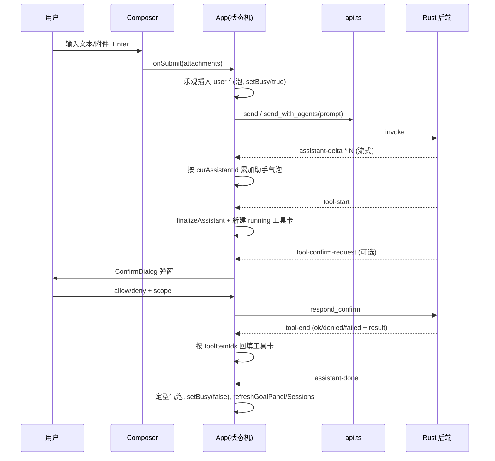

# 前端架构（React + Tauri 绑定）

> 适用版本：`src/` 当前实现。本文聚焦数据流与事件契约，不逐行解释样式。
> 引用约定：所有路径相对仓库根；行号形如 `src/App.tsx:159`，随代码演进可能漂移，请以符号名为准。

## 一、模块职责与定位

前端是 Demiurge 的"展示与交互"层，本身不持有任何业务真值：

- 它通过 **Tauri command（`invoke`）** 向 Rust 后端拉取/提交状态（设置、会话、目标、权限、上下文统计等）；
- 通过 **Tauri event（`listen`）** 接收后端推送的流式增量与状态变化（助手 token、工具开始/结束、确认请求、目标进度、会话引擎状态等）；
- 自己只维护"派生的 UI 状态"——把后端事件折叠（fold）成一个可渲染的 `DisplayItem[]` 时间线，以及若干面板状态。

这一定位决定了前端的核心设计原则：**后端是单一事实源（single source of truth），前端做乐观更新 + 事件对齐**。例如发送消息时前端会立刻插入一条 user 气泡（乐观），但助手内容、工具调用、目标进度都来自后端事件回填；会话列表、目标面板在每个回合结束后都会重新 `refresh`，以后端为准纠偏。

入口装配在 `src/main.tsx:14`：`ReactDOM` 根节点用 `<LanguageProvider>` 包裹 `<App />`，并在此统一引入字体（Inter / JetBrains Mono / MiSans 子集）、`style.css`、KaTeX 与 highlight.js 的 GitHub 主题样式。

```text
main.tsx
  └─ LanguageProvider (i18n context)
       └─ App  ← 唯一的状态编排中心
            ├─ Sidebar / 顶栏 (pack & agent 菜单, plan 横幅)
            ├─ GoalBar / MessageList / Composer  (chat 视图)
            ├─ MediaStudio (media 视图)
            ├─ SkillsPanel (skills 视图)
            ├─ SettingsDialog (settings 视图)
            └─ ConfirmDialog (全局模态)
```

## 二、关键类型与入口

### 2.1 共享类型 `src/lib/types.ts`

该文件是前后端的"接口契约"，注释开宗明义："与 Rust 端结构对应的前端类型"。关键分组：

- **领域模型**：`Message`、`ToolCall`/`FunctionCall`、`Settings`、`McpServerConfig`、`PackManifest`、`AgentDefinitionInfo`、`SkillSummary`、`SessionMeta`/`SessionList`。
- **联合判别类型**：`ProviderKind`（19 个 provider 字面量）、`PermissionMode`（`plan|default|auto|bypass`）、`ReasoningEffort`（`auto|low|medium|high|xhigh|max`）、`PermissionScope`（`once|session|project|user`）、`ToolRisk`（`read_only|mutating|external|privileged`）、`GoalStatus`、`WorkflowStatus`、`TurnStatus`。
- **后端 emit 的事件载荷**（`types.ts:643` 起）：`ToolStartEvent`、`ToolEndEvent`、`ConfirmRequestEvent`、`GoalProgressEvent`、`AssistantErrorEvent`，以及统一信封 `AgentEventEnvelope<T>`（`kind`/`turn`/`timestamp`/`payload`）。
- **前端专属展示类型**：`DisplayItem`（`types.ts:703`）是一个三态可辨识联合 `user | assistant | tool`，是整个聊天时间线的渲染单元，**不直接等同于后端 `Message`**——见第三节的折叠算法。

`SessionEnginePanelState`（`types.ts:536`）含 `busy`、`cancel_requested`、`active_turn?`、`last_turn?`，是回合级运行状态的权威来源；`TurnRunState` 描述单个回合（`entrypoint: send | send_with_agents`、`status`、`input_preview` 等）。

### 2.2 typed invoke/listen 封装 `src/lib/api.ts`

`api.ts` 把所有 Tauri 调用收敛成强类型函数，避免组件里散落裸 `invoke`/`listen`，集中管理命令名与 payload 形状：

```ts
export const send = (text: string) => invoke<void>("send", { text });
export const sendWithAgents = (text: string, agentNames: string[]) =>
  invoke<void>("send_with_agents", { text, agentNames });
export const respondConfirm = (id, allow, scope) =>
  invoke<void>("respond_confirm", { id, allow, scope });
```

命令覆盖：对话（`send`/`send_with_agents`/`interrupt`）、会话引擎（`session_engine_state`）、设置与连接测试、权限/计划（`set_permission_mode`/`plan_state`/`approve_plan`/`reject_plan`/`permission_*`/`shell_policy_state`）、MCP、人格包、自定义 agent、目标（`goal_*`）、历史与上下文统计、技能/记忆、会话 CRUD、媒体生成、WebDAV、OCR、工作流（`workflow_*`），以及语音占位命令。

事件订阅分两类：
1. **零散单事件 listener**：`listenPlanUpdated`、`listenPermissionModeUpdated`、`listenSettingsUpdated`、`listenSessionEngineUpdated`、`listenWorkflowUpdated`、`listenMcpUpdated`、`listenOcrDownloadProgress`、`listenUnifiedAgentEvents`（统一信封 `agent-event`）。
2. **聚合订阅 `listenAgentEvents(handlers)`**（`api.ts:170`）：一次性 `listen` 九个 legacy 事件（`assistant-start/-delta/-done/-error/-interrupted`、`tool-start/-end`、`tool-confirm-request`、`goal-progress`），返回一个统一反注册函数 `() => uns.forEach(u => u())`。`App.tsx` 当前用的就是这套聚合订阅。

> 注意：`agent-event` 统一信封（`AgentEventEnvelope`）与 `listenUnifiedAgentEvents` 已在 `api.ts` 中定义并由后端发出，但 `App.tsx` 现行消费的是上述 **legacy 命名事件**（`assistant-*`/`tool-*`），并未消费统一信封。换言之 `listenUnifiedAgentEvents` 当前在前端处于"已封装但未接入主时间线"的状态，是为后续迁移预留的入口。

### 2.3 主组件 `src/App.tsx`

`App` 是唯一的"状态编排中心"，集中持有大约二十个 `useState` 和一组 `useRef`（`App.tsx:161` 起）。useState 管"要渲染的值"，useRef 管"跨事件回调的可变游标"，这一分工是理解事件折叠的关键：

| useRef | 作用 |
| --- | --- |
| `seq` / `genId()` | 生成稳定的 DisplayItem id（`it_N`），保证 React key 稳定 |
| `curAssistantId` | 当前正在流式累积的助手气泡 id（null 表示尚未开始） |
| `toolItemIds` | `tool_call_id -> DisplayItem.id` 映射，用于把 `tool-end` 对齐到 `tool-start` 创建的卡片 |
| `lastRetryText` | 最近一次发送的完整 prompt，供错误气泡的"重试"复用 |
| `assistantErrorDelivered` | 标记后端是否已通过 `assistant-error` 事件交付过错误，避免 `handleSend` 的 catch 再补一条重复错误 |

## 三、核心数据流与算法

### 3.1 启动初始化（并行拉取 + 浏览器降级）

`App` 挂载时一次性并行拉取八个后端状态（`App.tsx:226`）：

```ts
const [s, ps, agents, goal, list, hist, plan, engine] = await Promise.all([
  api.getSettings(), api.listPacks(), api.agentPanelState(), api.goalPanelState(),
  api.listSessions(), api.getHistory(), api.planState(), api.sessionEngineState(),
]);
```

随后用 `buildHistory(hist)` 把后端 `Message[]` 折叠成 `DisplayItem[]`，并根据 `s.language` 同步 i18n。

**浏览器预览降级**：所有 Tauri 交互都判定 `"__TAURI_INTERNALS__" in window`。当不在 Tauri 容器内（如纯浏览器开发/截图），初始化 `catch` 分支会注入 `PREVIEW_SETTINGS`（`App.tsx:38`）让 UI 仍可浏览；`Dashboard`、`SkillsPanel` 等也各自带 mock 数据回退。窗口尺寸同样仅在 Tauri 下应用（`DEFAULT_WINDOW_SIZE = 1811×1213`，`App.tsx:35`/`214`）。

### 3.2 历史折叠 `buildHistory`（`App.tsx:107`）

把后端的对话 `Message[]`（含 `role: user|assistant|tool`）压平成时间线：

1. 先扫描一遍，把所有 `role === "tool"` 的消息按 `tool_call_id` 收进 `results` Map（工具结果）。
2. 再顺序遍历：
   - `user` 消息：跳过以 `"[Goal "` 开头的内部目标注入消息（这类是目标系统写回历史的合成 user 消息，不应展示给用户）。
   - `assistant` 消息：先推 `assistant` 文本气泡，再为每个 `tool_calls` 解析 `function.arguments`（JSON.parse，失败则原样保留字符串），生成 `kind: "tool"` 卡片，并从 `results` Map 回填 `result`，状态直接标 `done`。

这套折叠保证了"刷新历史/切换会话"得到的静态时间线，与"实时事件流"构造出的时间线结构一致。

### 3.3 实时事件状态机（`App.tsx:275` 的大 useEffect）

这是前端最核心的状态机。一个 `finalizeAssistant()` 闭包负责把当前流式气泡定型（`streaming: false`），各事件处理如下：

```text
assistant-start   → finalizeAssistant()             (上一段助手定型，准备新段)
assistant-delta   → 若无 curAssistantId 则新建流式气泡，否则把 text 追加到该气泡
assistant-done    → 用最终文本兜底定型该气泡；busy=false；refreshGoalPanel
assistant-error   → finalizeAssistant + 置 errorDelivered；
                    用 friendlyAssistantError() 生成可读错误气泡(含 retryText)
assistant-interrupted → finalizeAssistant；busy=false
tool-start  → finalizeAssistant；新建 tool 卡片(status=running)；
              记录 toolItemIds[tool_call_id]=新id
tool-end    → 按 toolItemIds 或 tool_call_id 命中卡片，更新 status
              (denied|done|failed)、result、duration_ms、error_hint、source_quality
tool-confirm-request → setConfirmReq(e) 触发 ConfirmDialog
goal-progress → 更新 goalProgress + refreshGoalPanel + 追加一条 name="goal" 的 tool 卡片
```

关键设计点：

- **流式拼接靠 `curAssistantId` 游标**。第一段 delta 创建气泡并把 id 写入 ref；后续 delta 直接 `it.text + text` 累加（`App.tsx:298`）。任何一个 `assistant-start`/`tool-start` 都会先 `finalizeAssistant()`，从而实现"助手文本 → 工具调用 → 助手文本"交替时每段各自成块。
- **工具卡片对齐靠 `toolItemIds` Map**。`tool-end` 命中条件为 `it.id === id || it.tool_call_id === e.tool_call_id`（`App.tsx:368`），双保险防止 Map 丢键。
- **错误的双通道兜底**：后端的 `assistant-error` 事件是主通道；`handleSend` 的 try/catch 是 `invoke` 本身抛错（如根本没连上）的兜底通道。`assistantErrorDelivered` ref 防止两条通道重复插入错误气泡（`App.tsx:485`）。
- **错误可读化** `friendlyAssistantError`（`App.tsx:77`）：根据 `event.kind` 与消息文本里的关键字（401/403/unauthorized、timeout、network/dns/econn/fetch 等）映射出 `{title, message, hint, retryable}`，并优先采用后端给的 `hint`。`retryable` 决定错误气泡是否带"重试"按钮，重试用的是 `lastRetryText.current`。

另有四个独立 listener（`App.tsx:404` 起），各自 fold 进对应 state：`plan-updated → setPlanState`、`permission-mode-updated → 合并进 settings.permission_mode`、`settings-updated → setSettings(+ 同步语言)`、`session-engine-updated → setSessionEngine(+ setBusy)`。

所有订阅都用 `disposed` 标志 + 反注册函数处理"effect 卸载早于 listen Promise resolve"的竞态（`App.tsx:399`）：若已卸载就立即调用返回的 unlisten。

### 3.4 发送回合 `handleSend`（`App.tsx:461`）

```text
handleSend(text?, attachments=[])
  ├─ 文本 trim + buildAttachmentPrompt(附件) 拼成最终 prompt
  ├─ 若 text 与附件均空，或 appBusy，则直接 return false
  ├─ 乐观插入 user 气泡(buildUserDisplayText 含附件清单)
  ├─ setBusy(true)；记录 lastRetryText = prompt
  ├─ selectedAgentNames 非空 → api.sendWithAgents，否则 api.send
  ├─ catch：若 errorDelivered 未置位则补一条错误气泡
  └─ finally：setBusy(false)；refreshSessions()；refreshGoalPanel()
```

`appBusy = busy || sessionEngine?.busy === true`（`App.tsx:192`）——本地乐观 busy 与后端引擎 busy 取并集，避免单回合内重复发送。注意 prompt 在文本为空时回退为 `"Please review the attached files."`（`App.tsx:472`）。

### 3.5 运行态派生（thinking / runtimeStatus）

底部状态由几个派生量驱动（`App.tsx:703`）：

- `tailStreaming` = 末项是流式助手气泡；`tailToolRunning` = 末项是 running 工具卡。
- `thinking = appBusy && !tailStreaming && !tailToolRunning`——即"忙但尚无可见进度"，此时 `MessageList` 渲染三点 ThinkingDots。
- `runtimeStatus`（顶栏文字）：`cancel_requested` 或 `active_turn.status==="cancelling"` → "正在取消"；有 `active_turn` → "正在处理"；否则 "就绪"（i18n key `status.*`）。

### 3.6 目标（Goal）控制流

`GoalBar`（`src/components/GoalBar.tsx`）渲染 `GoalPanelState`：双进度条分别表示 token 预算占用（`tokens_used/token_budget`，无预算时显示满格并提示 unlimited）与 continuation 回合占用（`turns_executed/max_turns`）。四个动作按钮的可用性完全由后端给的 `can_pause/can_resume/can_continue/can_clear` 布尔位驱动，前端不自行推断。

`handleGoalAction`（`App.tsx:521`）把动作映射到 `goalPause/goalResume/goalContinue/goalClear` 命令；其中 `resume`/`continue` 会本地置 busy 并切到 chat 视图，因为它们会触发新的后端回合。

### 3.7 计划模式（Plan）

`planState`（`PlanState`：`active/approved/path/content`）来自 `plan_state` 命令与 `plan-updated` 事件。当 `planState.path && !planState.approved` 时，顶栏渲染"方案就绪"横幅与采纳/拒绝按钮（`App.tsx:860`）。`handleApprovePlan` 调 `approve_plan` 后还会重新 `getSettings`（因为采纳计划通常伴随权限模式从 `plan` 切换，后端会改 settings）。

### 3.8 上下文预算（ContextMeter）

`ContextMeter`（`src/components/ContextMeter.tsx`）是 Composer 里的环形用量表。它独立调用 `contextPanelState()` 拉取 `ContextPanelState`，用 `projected_total_tokens / max_input_tokens` 算占用比 `frac`，并据此切换环色（≥0.92 红 / ≥0.72 橙 / 否则绿）。展开 popover 展示分项：消息数、系统提示、工具、摘要、历史、历史预算、预留输出、最大输入。这些字段全部来自后端的真实预算账本（`ContextPanelState` 含 `prompt_sections`、`history_buckets`、`memory_sources` 等更细的报告，主要在 SettingsDialog 的 Context 标签消费）。

## 四、附件处理 `src/lib/fileProcessing.ts`

附件在**渲染层（前端）**就被解析成纯文本注入 prompt，后端回合开始前并不重复读取这些文件。

- `processFiles` 最多取前 8 个文件（`fileProcessing.ts:116`）并发处理；`detectKind` 按 MIME + 扩展名分类为 `text/image/pdf/document/spreadsheet/presentation/unsupported`。
- 文本类：直接 `file.text()`；统一经 `clip()` 截断到 `MAX_FILE_CHARS = 28000` 字符并追加截断提示。
- PDF：动态 `import("pdfjs-dist")`，worker 用 `?url` 形式加载；最多抽取前 `MAX_PDF_PAGES = 80` 页文本（`extractPdfText`）。
- Office（docx/pptx/xlsx/xlsm）：用 `JSZip` 解开 OpenXML，再用 `DOMParser` 提取文本——docx 取 `word/document.xml` 的 `<w:p>` 段落，pptx 按 `ppt/slides/slideN.xml` 顺序取 `<a:t>` 文本，xlsx 解析 `sharedStrings.xml` + `worksheets/sheetN.xml`（区分 `t="s"` 共享串 / `inlineStr` / 数值）。
- 图像：默认仅生成 `URL.createObjectURL` 预览并标注 "OCR integration is not configured"；但 Composer 调用 `processFiles` 时**传入了 `extractImageText: api.ocrImageBytes`**（`Composer.tsx:352`），因此实际运行时会尝试本地 OCR（`ocr_image_bytes` 命令），失败时降级为仅预览并把错误写进 `note`。

`buildAttachmentPrompt`（`fileProcessing.ts:120`）把所有 `status==="ready"` 的附件渲染成带 `<file name="...">…</file>` 包裹的 Markdown 块，标题为 "Attached files processed by Demiurge"；`buildUserDisplayText`（`App.tsx:145`）则生成给用户看的简短附件清单（名称/类型/大小/ready|failed）。`releaseAttachment` 负责回收 `blob:` 预览 URL，Composer 在卸载与移除时都会调用，防内存泄漏。

## 五、Provider 目录与上下文窗口推断 `src/lib/providers.ts`

- `PROVIDER_OPTIONS`：19 个 provider 的目录（label / baseUrl 默认 / 默认 model / help / 推荐 models 列表）。`findProvider` 找不到时回退到列表第一项。
- `PROVIDER_ICON_SET`：声明哪些 provider 在 `public/providers/<key>.svg` 有图标（图标来自 `@lobehub/icons-static-svg`，MIT）。注意 `custom` 不在图标集中。
- **上下文窗口推断**是这里的核心算法：`MODEL_CONTEXT_WINDOWS` 是模型 id → 最大输入 token 的硬编码表；`modelContextWindow(provider, model)` 先精确匹配（小写），OpenRouter 的 `vendor/model` 形式则回退匹配末段 model id，再退到 `PROVIDER_FALLBACK_WINDOW` 的 per-provider 兜底，全不中则返回 `null`。
- `autoContextBudget`（`providers.ts:369`）：在窗口已知时，给出 `{maxInput: 窗口, reservedOutput: clamp(窗口*0.125, [1024, 64000])}`。`App.handleSetModel`（`App.tsx:640`）在 `settings.context_budget_auto` 为真时调用它，使切换模型自动重算输入预算；窗口未知则保留用户手填值。

## 六、国际化 `src/lib/i18n.tsx`

- `LanguageProvider` 提供 `{lang, setLang, t}` context；默认语言 `zh`，并通过 `localStorage` key `demiurge.lang` 持久化（`initialLang`）。`setLang` 同时写 localStorage，并在 effect 中同步 `document.documentElement.lang`。
- `t(key, vars?)`：查表顺序为 当前语言表 → 中文表兜底 → 返回 key 本身；`vars` 用 `{name}` 占位符做全局替换。
- 字典 `zh`/`en` 覆盖侧栏、聊天、Dashboard、Composer、Skills、各 Settings 标签等。`App` 在初始化与 `settings-updated` 时都会用 `s.language` 反向同步 `setLang`，使后端设置与前端 localStorage 一致。

> 现状提示：i18n 已系统化覆盖侧栏/Composer/Settings/Skills/Dashboard，但 `MessageList`、`ToolCard`、`ConfirmDialog`、`GoalBar`、`WorkflowsPanel`、`MediaStudio` 等组件内仍有硬编码英文文案（如 "Thinking..."、"Retry"、"Done/Running"、"Approve Tool Call"、"Resume" 等）。这是当前实现的真实状态，尚未全部接入 `t()`。

## 七、各核心组件职责与数据流

| 组件 | 职责 | 关键数据来源 |
| --- | --- | --- |
| `Sidebar` | 视图切换(chat/media/skills/settings)、会话列表 CRUD（双击/编辑重命名、删除）、新对话、打开沙盒 | `sessions`/`activeId`，回调全部上提到 App |
| `Composer` | 输入框、slash 命令面板、附件、语音录制、权限模式/模型/推理强度选择、ContextMeter、发送/停止 | `settings` 片段 + `processFiles` |
| `MessageList` | 渲染 `DisplayItem[]` 时间线；空时显示 `Dashboard`；自动滚到底；thinking 三点 | `items`/`thinking` |
| `AssistantMessage` | 助手气泡：正常走 `Markdown`，错误走黄色错误框(标题/正文/hint/重试) | `DisplayItem.assistant` |
| `ToolCard` | 工具卡：状态徽章、风险/耗时、进度文案、来源质量、可展开看 args/preview/result | `DisplayItem.tool` |
| `ConfirmDialog` | 工具确认模态：展示 args/affected_paths/preview(DiffPreview)，选择授权 scope(once/session/project/user) | `confirmReq` |
| `GoalBar` | 目标状态条 + 双进度 + 四动作按钮 | `goalPanel`/`goalProgress` |
| `ContextMeter` | 环形上下文用量 + 分项 popover | 独立拉 `contextPanelState` |
| `SkillsPanel` | 技能检索面板：250ms 防抖按 query 调 `skill_panel_state` 打分预览 | 独立拉 `skillPanelState(query)` |
| `Dashboard` | 空对话欢迎页 + 统计卡片 + 贡献热力图 | 独立拉 `sessionStats(tzOffset)` |
| `MediaStudio` | 图像生成 / TTS 工作区(DashScope 原生) | 独立调 `media_*` |
| `Markdown`/`MermaidBlock`/`DiffPreview` | Markdown 渲染、Mermaid 图、diff 着色 | 纯展示 |
| `SettingsDialog` | 多标签设置面板(provider/media/web/files/context/tools/voice/advanced) | 独立订阅 `mcp-updated` 等 |
| `WorkflowsPanel` | 工作流面板组件（**当前未被任何源文件引入**，见第十节） | `workflow_panel_state` + `workflow-updated` |

### 7.1 Composer 的几个机制

- **Slash 命令面板**：仅当输入以 `/` 开头且不含空格时激活（`Composer.tsx:120`），按前缀过滤 `SLASH_COMMANDS`（`/goal /effort /compact /ultracode /workflows /workflow /skills /dream`，这些命令实际由后端 `send` dispatcher 处理）。支持 ↑↓ 选择、Tab/Enter 应用、Esc 关闭。**命令本身不在前端执行**，只是把 `"/cmd "` 填入输入框，最终随 `send` 提交给后端。
- **发送/停止合一**：右下角主按钮在 `loading` 时变为 Stop（调 `onStop` → `api.interrupt()`），否则为提交（`Composer.tsx:631`）。`readyToSend = (canSend || 有就绪附件) && !processingFiles`。
- **语音输入**：用浏览器 `MediaRecorder` 录音，停止后把 Blob 转字节数组交给后端 `voiceTranscribe`。但调用前先 `voiceStatus()` 检查 `ready`，**当前后端 STT/TTS 是占位实现**（见 `api.ts:118` 注释"backend not implemented"），所以正常路径会弹出 toast 提示"语音转写后端尚未接入"。设备选择 id 仅前端 localStorage 持久化（`demiurge.voiceInputDeviceId`），不进 Settings。

### 7.2 ToolCard 的语义增强（`src/components/ToolCard.tsx`）

`progressSummary` 针对工具名做了人性化文案：`mcp__server__tool` 解析出 server/tool；`web_search` 用正则 `^\d+\. \[` 数返回的来源链接条数；`web_fetch` 显示 URL。`source_quality`（strong/limited/none）按等级着色提示检索证据强度。`rollbackHint` 在 edit 类工具结果里检测 `undo_records: edit_` 提示可回滚。失败状态默认自动展开详情并用 `DiffPreview` 渲染结果。

### 7.3 Markdown 流式稳定化（`src/components/Markdown.tsx`）

为消除流式输出时的渲染抖动做了两处处理：
- `closeUnclosedFence`：流式时若 ``` ``` `` 数量为奇数，临时补一个闭合围栏，避免代码块/普通文本反复横跳。
- `normalizeMath`：把 `\[ \] \( \)` 归一为 `$$`/`$`，并先用占位符保护代码块不被误伤。
- `rehypeHighlight` 用 `detect:false`，只高亮带语言标记的代码块，规避自动探测语言导致的变色闪烁。
- Mermaid 块由 `MermaidBlock` 用 `securityLevel: "strict"` 动态 `import("mermaid")` 渲染，先 `parse` 再 `render`，并修掉 `translate(undefined, NaN)` 的渲染瑕疵。

## 八、与其他模块的交互边界

```text
┌────────────── React 前端 ──────────────┐
│ App (编排)                              │
│   invoke ──────────────► Tauri command │──► Rust AppState (lib.rs / session_engine / agent)
│   listen ◄────────────── Tauri event   │◄── 后端 emit (assistant-*/tool-*/goal-progress/...)
│                                         │
│ fileProcessing：前端解析附件→prompt 文本 │
│ providers：模型上下文窗口推断(前端常量)  │
└─────────────────────────────────────────┘
```

- **唯一后端入口**是 `api.ts` 的命令/事件封装；组件层不直接 `import @tauri-apps/api`（除 App 用 window API 设尺寸、WorkflowsPanel/SettingsDialog 直接用 `UnlistenFn` 类型外）。
- **附件**在前端解析，后端只收到拼好的 prompt 文本；**上下文窗口**推断逻辑前端有一份常量表（与后端 provider 档案上限是两套来源，需保持一致——见已知限制）。
- **目标/计划/权限/会话** 的真值全在后端，前端通过命令读写 + 事件对齐。

## 九、安全与权限相关点

- **工具确认门**：后端发 `tool-confirm-request` → `ConfirmDialog` 强制用户选择 allow/deny 与作用域 `once|session|project|user`，回传 `respond_confirm`。这是前端唯一参与权限决策的环节，决策落库由后端完成。`ConfirmDialog` 会展示 `risk`、`effect`（策略）、`source`（tool_default/user_override/unknown_tool）、`affected_paths` 与 `preview`（diff），让用户知情。
- **权限模式** `plan|default|auto|bypass` 在 Composer 选择，`bypass` 用醒目红底提示其放行风险（`Composer.tsx:412`）。
- **MCP env 密钥**：`McpEnvVar.secret` 标记的键由后端存入系统凭据管理器（i18n 文案明确"疑似密钥的键会保存在系统凭据管理器中"）；前端只传配置。
- **API key 存储**：Settings 文案声明密钥"安全保存在 settings.json 之外"（系统 keyring），前端类型里虽有 `api_key` 字段但其持久化由后端凭据层负责。
- **Mermaid `securityLevel: "strict"`**、Markdown 链接统一 `target=_blank rel=noreferrer`，降低渲染注入风险。`dangerouslySetInnerHTML` 仅用于 Mermaid 渲染出的受控 SVG。

## 十、已知限制与扩展点

1. **`WorkflowsPanel.tsx` 未接入 UI**。经全仓检索，除其自身与 `docs/IMPLEMENTATION.md` 外，没有任何源文件 `import` 它；工作流目前只能通过 Composer 的 `/workflows`、`/workflow resume <run_id>` slash 命令交由后端处理。该组件（含 `workflow-updated` 实时订阅、run 详情/重试/恢复 UI）是已完成但未挂载的扩展点。
2. **统一事件信封未消费**。`agent-event` / `AgentEventEnvelope` / `listenUnifiedAgentEvents` 已在 `api.ts` 定义，但 `App.tsx` 实际消费的是 legacy 命名事件（`assistant-*`/`tool-*`/`goal-progress`）。迁移到统一信封是预留方向。
3. **语音 STT/TTS 为占位后端**。`voice_transcribe`/`voice_synthesize`/`voice_status` 命令在 `api.ts:118` 明确标注"intentionally return a clear backend-not-implemented error"；Composer 的录音 UI 完整可用，但转写在选定具体 provider 前不会产出文本。Settings 的语音标签文案亦称"后端接口已预留"。
4. **上下文窗口表是前端硬编码**。`MODEL_CONTEXT_WINDOWS` 需随模型迭代手工维护，且与后端 provider 档案的实际上限是两套来源；不一致时以后端为准（前端仅用于自动建议输入预算数值）。
5. **附件上限/截断**：单次最多 8 个文件、每文件 28000 字符、PDF 前 80 页——超限静默截断并加提示，没有 UI 让用户调整这些上限。
6. **i18n 覆盖不完整**：聊天区与若干对话框仍有硬编码英文（见第六节提示），是最直接的可扩展点。
7. **DisplayItem 不可编辑/重发**：除错误气泡的"重试"外，时间线没有消息编辑、分支或单条删除能力。

---

附：一次回合的端到端数据流（前端视角）


